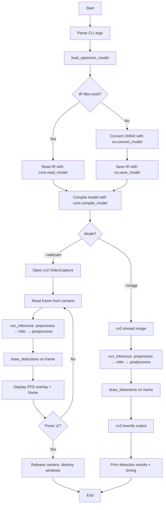

# CV Assignment 10: Object Detection using OpenVINO Toolkit

This assignment demonstrates **real-time object detection** using the **OpenVINO** toolkit (Intel's AI inference engine) with a **YOLOX-Nano** detector. The pipeline covers model conversion from ONNX to OpenVINO's native IR format, compilation on CPU, image preprocessing (letterbox resize + pad), inference, anchor-free grid decoding, Non-Maximum Suppression (NMS), and annotated output rendering.

Two execution modes are provided:

1. **Static image mode** (`--image`) — processes a single image and saves the annotated output. Works on any machine.
2. **Webcam mode** (`--webcam`) — processes a live camera feed with FPS display. Requires a physical camera.

The sample input image (`sample_input.jpg`) depicts a city street scene with a public transit bus and pedestrians — a rich test case for the 80-class COCO detector.

---

## Theory

### What is OpenVINO?

**OpenVINO** (Open Visual Inference and Neural Network Optimization) is Intel's toolkit for optimizing and deploying AI inference models. It takes a trained model (e.g., in ONNX, TensorFlow, or PyTorch format) and converts it to an optimized Intermediate Representation (IR) consisting of `.xml` (model structure) and `.bin` (weights) files. The IR model is then compiled for a target device (CPU, GPU, or AUTO) and executed with high throughput and low latency.

### YOLOX-Nano

**YOLOX-Nano** is an anchor-free, single-stage object detector from the YOLOX family. Key characteristics:

- **Anchor-free**: Unlike earlier YOLO versions, YOLOX predicts bounding boxes directly from grid points rather than from predefined anchor boxes. This simplifies the decoder and reduces hyperparameters.
- **80-class COCO detector**: Trained on the COCO dataset (Common Objects in Context), it can detect 80 categories of objects including people, vehicles, animals, and household items.
- **Output format**: The network produces a tensor of shape `(1, N, 85)` where each detection has 4 bounding box coordinates (cx, cy, w, h), 1 objectness score, and 80 class confidence scores.

### OpenVINO Inference Pipeline

The pipeline consists of four stages:

1. **Model Conversion**: The ONNX model is converted to OpenVINO IR using `ov.convert_model()` and saved with `ov.save_model()`. If the IR files already exist, they are loaded directly to skip conversion.

2. **Model Compilation**: `ov.Core().compile_model()` compiles the IR model for a target device (CPU, GPU, or AUTO). This step optimizes the graph for the hardware, including layer fusion and memory planning.

3. **Preprocessing**: Each frame is letterbox-resized to the model's input resolution (416×416 for YOLOX-Nano), padded to maintain aspect ratio, and transposed from HWC to NCHW format.

4. **Post-processing**: The raw network output is decoded (grid offsets + stride scaling), converted from cxcywh to xyxy format, scaled back to the original image dimensions, filtered by confidence threshold, and refined with per-class NMS.

### Letterbox Resizing

Letterbox resizing scales the image by a single ratio (the minimum of width and height ratios) so the aspect ratio is preserved, then pads the remaining space with a neutral color (114 in this implementation). This prevents distortion and ensures the aspect ratio information is retained in the `ratio` variable, which is used during post-processing to map detections back to original coordinates.

### Non-Maximum Suppression (NMS)

NMS eliminates redundant overlapping detections. For each object class:

1. Sort all candidate boxes by confidence score (descending).
2. Select the highest-scoring box and keep it.
3. Compute the **Intersection over Union (IoU)** between this box and all remaining boxes.
4. Discard any box with IoU above the NMS threshold (0.45 in this assignment).
5. Repeat with the next highest-scoring box until no candidates remain.

The IoU between two boxes $A$ and $B$ is:

$$\text{IoU} = \frac{\text{Area}(A \cap B)}{\text{Area}(A) + \text{Area}(B) - \text{Area}(A \cap B)}$$

---

## Code Explanation (Function by Function)

### Constants and Configuration

```python
COCO_CLASSES = ( ... 80 class names ... )
CLASS_COLORS = np.random.randint(60, 255, size=(80, 3)).tolist()
INPUT_SIZE = (416, 416)
SCORE_THRESHOLD = 0.30
NMS_THRESHOLD = 0.45
```

- **`COCO_CLASSES`**: The 80 object categories in COCO dataset order (person, bicycle, car, ..., toothbrush). Used to map predicted class indices to human-readable labels.
- **`CLASS_COLORS`**: A deterministic BGR color per class (seeded with `np.random.seed(42)`), ensuring consistent box colors across runs.
- **`INPUT_SIZE`**: YOLOX-Nano's trained input resolution — 416×416 pixels (H, W).
- **`SCORE_THRESHOLD`** (0.30): Minimum confidence for a detection to be retained.
- **`NMS_THRESHOLD`** (0.45): Maximum IoU between two detections of the same class before the lower-scoring one is suppressed.

### `load_openvino_model(onnx_path, ir_xml_path, device)`

```python
core = ov.Core()
if ir_xml_path.exists():
    model = core.read_model(ir_xml_path)
else:
    model = ov.convert_model(onnx_path)
    ov.save_model(model, str(ir_xml_path))
compiled_model = core.compile_model(model, device)
```

This function handles the full model lifecycle:

1. **Create `ov.Core()`**: The top-level OpenVINO object that manages devices and model compilation.
2. **Check for existing IR**: If `.xml`/`.bin` files already exist, load them directly with `core.read_model()` to skip conversion.
3. **Convert ONNX → IR**: `ov.convert_model()` parses the ONNX graph and produces an OpenVINO `Model` object. `ov.save_model()` serializes it to `.xml` (structure) and `.bin` (weights).
4. **Compile**: `core.compile_model()` optimizes and loads the model onto the target device, returning a `CompiledModel` used for inference.

### `preprocess(img, input_size)`

```python
padded = np.ones((input_size[0], input_size[1], 3), dtype=np.uint8) * 114
ratio = min(input_size[0] / img.shape[0], input_size[1] / img.shape[1])
resized = cv2.resize(img, (int(img.shape[1] * ratio), int(img.shape[0] * ratio)),
                     interpolation=cv2.INTER_LINEAR)
padded[:resized.shape[0], :resized.shape[1]] = resized
chw = padded.transpose(2, 0, 1)[None].astype(np.float32)
return chw, ratio
```

- A **gray canvas** (value 114) is created as the base for letterboxing.
- **`ratio`** is the uniform scale factor (minimum of width/height ratios), preserving aspect ratio.
- The image is resized via `cv2.resize` with bilinear interpolation.
- The resized image is placed in the top-left corner of the padded canvas.
- The result is transposed from **HWC** (Height, Width, Channels) to **CHW** (Channels, Height, Width), batched to **NCHW** (add a leading dimension), and cast to `float32`. Pixel values remain in 0–255 (no normalization) — YOLOX-Nano expects raw pixel values.
- Returns the preprocessed tensor and the scale ratio for coordinate mapping.

### `decode_predictions(outputs, input_size)`

```python
for stride in (8, 16, 32):
    h, w = input_size[0] // stride, input_size[1] // stride
    xv, yv = np.meshgrid(np.arange(w), np.arange(h))
    grids.append(np.stack((xv, yv), 2).reshape(1, -1, 2))
    strides_list.append(np.full((1, h * w, 1), stride))
grids = np.concatenate(grids, 1)
strides = np.concatenate(strides_list, 1)
outputs[..., :2] = (outputs[..., :2] + grids) * strides
outputs[..., 2:4] = np.exp(outputs[..., 2:4]) * strides
```

YOLOX-Nano predicts from three detection heads at strides 8, 16, and 32 (producing feature maps of size 52×52, 26×26, and 13×13 for 416×416 input). This function:

1. **Builds grid coordinates**: For each stride, a meshgrid of (x, y) coordinates is created, representing the center position of each anchor point on the feature map.
2. **Decodes center coordinates**: `cx = (predicted_cx + grid_x) × stride` — the predicted offset is relative to the grid point, so it is added and scaled by the stride.
3. **Decodes dimensions**: `w = exp(predicted_w) × stride` and `h = exp(predicted_h) × stride` — the predicted width/height are log-space offsets, so `exp()` converts them back to absolute pixel dimensions.

### `nms(boxes, scores, thr)`

```python
x1, y1, x2, y2 = boxes[:, 0], boxes[:, 1], boxes[:, 2], boxes[:, 3]
areas = (x2 - x1 + 1) * (y2 - y1 + 1)
order = scores.argsort()[::-1]
keep = []
while order.size > 0:
    i = order[0]
    keep.append(i)
    xx1 = np.maximum(x1[i], x1[order[1:]])
    yy1 = np.maximum(y1[i], y1[order[1:]])
    xx2 = np.minimum(x2[i], x2[order[1:]])
    yy2 = np.minimum(y2[i], y2[order[1:]])
    w = np.maximum(0.0, xx2 - xx1 + 1)
    h = np.maximum(0.0, yy2 - yy1 + 1)
    inter = w * h
    ovr = inter / (areas[i] + areas[order[1:]] - inter)
    order = order[np.where(ovr <= thr)[0] + 1]
return keep
```

Classic greedy NMS implementation:

1. Sort boxes by score (descending).
2. Pick the top box, add it to `keep`.
3. Compute IoU between the top box and all remaining boxes using the formula:
   - Intersection area: `max(0, overlap_width) × max(0, overlap_height)`
   - Union area: `area_a + area_b - intersection`
4. Remove all boxes with IoU > threshold.
5. Repeat until no boxes remain.

### `postprocess(pred, ratio)`

```python
pred = decode_predictions(pred.copy())[0]  # (N, 85)
boxes = pred[:, :4]
obj_conf = pred[:, 4:5]
cls_conf = pred[:, 5:]
scores = obj_conf * cls_conf  # (N, 80)
xyxy = np.empty_like(boxes)
xyxy[:, 0] = boxes[:, 0] - boxes[:, 2] / 2.0  # cx - w/2
xyxy[:, 1] = boxes[:, 1] - boxes[:, 3] / 2.0  # cy - h/2
xyxy[:, 2] = boxes[:, 0] + boxes[:, 2] / 2.0  # cx + w/2
xyxy[:, 3] = boxes[:, 1] + boxes[:, 3] / 2.0  # cy + h/2
xyxy /= ratio  # Scale back to original image
cls_ids = scores.argmax(1)
cls_scores = scores[np.arange(len(cls_ids)), cls_ids]
mask = cls_scores > score_thr
# Per-class NMS
for c in np.unique(ids_f):
    c_mask = ids_f == c
    keep = nms(boxes_f[c_mask], scores_f[c_mask], nms_thr)
    for k in keep:
        detections.append((int(c), float(scores_f[c_mask][k]), b))
```

The complete post-processing pipeline:

1. **Decode** raw predictions into absolute coordinates.
2. **Compute class scores**: `obj_conf × cls_conf` gives the confidence for each (object, class) pair.
3. **Convert cxcywh → xyxy**: Standard bounding box format conversion (center + width/height → top-left + bottom-right).
4. **Scale back** to original image dimensions using `ratio`.
5. **Filter** by score threshold (0.30).
6. **Apply per-class NMS** (0.45) to remove duplicate detections.
7. Return a list of `(class_id, confidence, [x1, y1, x2, y2])` tuples.

### `draw_detections(img, detections)`

```python
for cls_id, score, box in detections:
    x1, y1, x2, y2 = [int(v) for v in box]
    color = CLASS_COLORS[cls_id % len(CLASS_COLORS)]
    label = f"{COCO_CLASSES[cls_id]} {score:.2f}"
    cv2.rectangle(img, (x1, y1), (x2, y2), color, 2)
    (tw, th), _ = cv2.getTextSize(label, cv2.FONT_HERSHEY_SIMPLEX, 0.55, 2)
    cv2.rectangle(img, (x1, max(0, y1 - th - 8)), (x1 + tw + 4, y1), color, -1)
    cv2.putText(img, label, (x1 + 2, y1 - 5), cv2.FONT_HERSHEY_SIMPLEX,
                0.55, (255, 255, 255), 2, cv2.LINE_AA)
```

For each detection:

1. Draw a **bounding box** in the class-specific color with thickness 2.
2. Draw a **filled label background** rectangle above the box.
3. Render the **label text** (class name + confidence) in white on the colored background using anti-aliased rendering (`LINE_AA`).

### `run_inference(compiled_model, frame)`

```python
blob, ratio = preprocess(frame)
output = compiled_model([blob])[compiled_model.output(0)]
return postprocess(output, ratio)
```

The inference entry point: preprocess the frame, run it through the compiled model, and post-process the output into detection list.

### `run_on_image(compiled_model, image_path, output_path)`

Loads an image, runs inference, draws detections, saves the annotated image, and prints detection results with timing information.

### `run_on_webcam(compiled_model, camera_index=0)`

Opens a webcam feed, runs inference on each frame, draws detections with FPS overlay, and displays in a window until the user presses 'q'.

### CLI Entry Point

```python
python openvino_object_detection.py --image input.jpg --output output.jpg
python openvino_object_detection.py --webcam
```

Arguments:

| Argument | Default | Description |
|----------|---------|-------------|
| `--onnx` | `models/yolox_nano.onnx` | Path to source ONNX model |
| `--ir` | `models/yolox_nano.xml` | Path to OpenVINO IR (.xml) |
| `--device` | `CPU` | OpenVINO device: CPU, GPU, AUTO |
| `--image` | `None` | Run detection on a single image |
| `--output` | `output.jpg` | Where to save the annotated image |
| `--webcam` | `False` | Run detection on a live webcam feed |

---

## Program Flow



---

## Files

| File | Description |
|------|-------------|
| `openvino_object_detection.py` | Main Python script implementing the OpenVINO object detection pipeline (model loading, preprocessing, inference, post-processing, drawing, and CLI). |
| `sample_input.jpg` | Sample input image (a city street scene with a public transit bus and pedestrians) used for testing the detection pipeline. |
| `sample_output.jpg` | Cached output image showing YOLOX-Nano detection results overlaid on the sample input. |
| `README.md` | This documentation. |

---

## Results Summary

| Mode | Input | Output | Notes |
|------|-------|--------|-------|
| Image | `sample_input.jpg` | `sample_output.jpg` | Detects buses, people, and other COCO objects in the street scene |
| Webcam | Camera device 0 | Live window | Displays annotated frames with FPS counter; press 'q' to quit |

---

## Requirements

- **Python 3.8+**
- **OpenVINO** (`openvino`) — provides `ov.Core()`, `ov.convert_model()`, `ov.save_model()`, and the inference runtime
- **OpenCV** (`opencv-python`) — image I/O, drawing, and display
- **NumPy** — array operations
- **argparse** — CLI argument parsing (stdlib)

---

## How to Run

### 1. Image Mode (recommended for this assignment)

```bash
python openvino_object_detection.py --image sample_input.jpg --output sample_output.jpg
```

This processes the sample image and saves the annotated result. Expected output:

```
[OpenVINO] Converting ONNX -> OpenVINO IR: models/yolox_nano.onnx
[OpenVINO] Compiling model for device: CPU
[Result] N object(s) detected in X.X ms
  - <class_name> conf=0.XX  box=[x1, y1, x2, y2]
[Saved] sample_output.jpg
```

### 2. Webcam Mode (requires a camera)

```bash
python openvino_object_detection.py --webcam --device CPU
```

Opens a window showing the live webcam feed with bounding boxes and an FPS counter. Press **'q'** to quit.

### 3. Specify a Different Device

```bash
python openvino_object_detection.py --image sample_input.jpg --device GPU
```

Valid devices: `CPU`, `GPU`, `AUTO` (OpenVINO auto-selects the best available device).

---

## Frequently Asked Questions

### Q1: What is the difference between ONNX and OpenVINO IR formats?

ONNX (Open Neural Network Exchange) is a cross-framework model format. OpenVINO IR (Intermediate Representation) is Intel's optimized format consisting of an `.xml` file (model graph/structure) and a `.bin` file (weights). OpenVINO IR is optimized for Intel hardware through layer fusion, memory optimization, and hardware-specific kernels, resulting in faster inference on Intel CPUs and integrated GPUs.

### Q2: Why is letterbox resizing used instead of direct resizing?

Direct resizing distorts the aspect ratio, which degrades detection accuracy because the model was trained on undistorted images. Letterbox resizing preserves the aspect ratio by scaling uniformly and padding the remaining space. The `ratio` variable is then used during post-processing to map detected coordinates back to the original image's scale.

### Q3: What does `cv2.transpose(2, 0, 1)` do in preprocessing?

It reorders the array dimensions from **HWC** (Height, Width, Channels) to **CHW** (Channels, Height, Width). Deep learning models typically expect input in NCHW format (batch, channels, height, width). The `[None]` adds a batch dimension, converting CHW to NCHW.

### Q4: Why is there no normalization in preprocess?

YOLOX-Nano was trained with pixel values in the 0–255 range (no normalization). Unlike many other models that expect inputs in [0, 1] or normalized with ImageNet mean/std, YOLOX expects raw uint8 pixel values cast to float32. This is a model-specific requirement.

### Q5: What is the purpose of `obj_conf * cls_conf` in post-processing?

YOLOX predicts two separate confidence components:
- **Objectness** (`obj_conf`): The probability that the bounding box contains any object (vs. background).
- **Class confidence** (`cls_conf`): The probability of each of the 80 classes given that an object is present.

Multiplying them gives the **final class-specific confidence**: `P(class | object) × P(object) = P(class and object)`. This is the score used for filtering and ranking detections.

### Q6: Why is NMS applied per-class rather than globally?

Different classes can have overlapping bounding boxes (e.g., a person standing next to a car). Applying NMS globally would incorrectly suppress a person detection because it overlaps with a car detection. Per-class NMS only suppresses duplicates within the same class, preserving valid detections of different objects.

### Q7: What does `compiled_model([blob])[compiled_model.output(0)]` do?

- `compiled_model([blob])` — runs inference by passing the preprocessed input tensor (wrapped in a list) to the compiled model. Returns a list of output arrays.
- `compiled_model.output(0)` — gets the name of the model's first (and only) output tensor.
- The indexing `[compiled_model.output(0)]` extracts that output array from the list.

### Q8: How does the anchor-free decoder work?

Unlike anchor-based YOLO versions that predict offsets from predefined anchor boxes, YOLOX predicts:
- **Center offset** (cx, cy): Relative displacement from each grid point, decoded as `(predicted + grid) × stride`.
- **Width/height** (w, h): Log-space scale factors, decoded as `exp(predicted) × stride`.

Each grid point on three feature maps (strides 8, 16, 32) acts as a potential object center. This anchor-free design simplifies the architecture and removes the need for anchor box hyperparameter tuning.

### Q9: Why set `np.random.seed(42)` for class colors?

Setting a seed ensures **deterministic** color generation. Every run produces the same color mapping for each class, making it easier to visually identify objects across multiple output images. Without the seed, colors would change on each run, causing confusion.

### Q10: What is the role of `cv2.LINE_AA` in `draw_detections`?

`cv2.LINE_AA` enables **anti-aliased** line rendering. Without it, text and rectangle edges appear jagged (stair-stepped). Anti-aliasing smooths edges by blending pixel colors at boundaries, producing cleaner, more readable labels and boxes.
