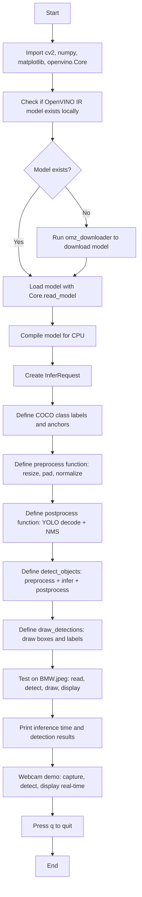

# CV Assignment 10: Object Detection Webcam using OpenVINO Toolkit

This assignment demonstrates **real-time object detection** using the **OpenVINO** toolkit and OpenCV's webcam interface. A pre-trained YOLOv3 model (`person-vehicle-bike-detection-crossroad-yolov3-1020`) is downloaded from the OpenVINO Model Zoo (OMZ), converted to OpenVINO IR format (`.xml` + `.bin`), and deployed for CPU inference using the OpenVINO Runtime Python API.

The notebook covers the full pipeline:
1. **Model Acquisition** — downloading a pre-trained model from OMZ using `omz_downloader`.
2. **OpenVINO Inference** — loading the IR model with `openvino.Core`, compiling for CPU, and running inference with `InferRequest`.
3. **Pre- and Post-Processing** — resizing/normalizing BGR frames and decoding YOLOv3 multi-scale outputs with NMS.
4. **Webcam Demo** — capturing webcam frames, running detection, and drawing bounding boxes with class labels and confidence scores.

---

## Theory

### OpenVINO Runtime

**OpenVINO** (Open Visual Inference & Neural Network Optimization) is an open-source toolkit for optimizing and deploying deep learning models. The core workflow is:
1. Train or obtain a model (PyTorch, TensorFlow, ONNX, etc.).
2. Convert the model to **OpenVINO IR** (Intermediate Representation) using the OpenVINO Model Optimizer (`omz_converter`). The IR consists of an `.xml` file (network topology) and a `.bin` file (weights).
3. Load the IR model with `openvino.Core`, compile it for a target device (CPU, GPU, VPU, etc.), and run inference.

The OpenVINO Runtime provides a unified API (`Core`, `CompiledModel`, `InferRequest`) that abstracts away hardware-specific details, enabling deployment on Intel CPUs, integrated GPUs, and VPUs with a single codebase.

### OpenVINO Model Zoo (OMZ)

The **OpenVINO Model Zoo** is a collection of pre-trained, pre-converted models optimized for OpenVINO. Models can be downloaded using the `omz_downloader` command-line tool, which fetches the model files and places them in the correct directory structure. The `person-vehicle-bike-detection-crossroad-yolov3-1020` model used in this assignment detects persons, vehicles, and bikes across 80 COCO object categories.

### YOLOv3 Object Detection

**YOLOv3 (You Only Look Once, version 3)** is a single-stage object detector that predicts bounding boxes and class probabilities directly from full images in one forward pass. The model uses **anchor boxes** — predefined width/height ratios — to stabilize bounding box predictions.

#### Multi-Scale Detection

YOLOv3 predicts detections at three different scales:
- **13×13** — large receptive field, detects large objects
- **26×26** — medium receptive field, detects medium objects
- **52×52** — small receptive field, detects small objects

Each scale uses 3 anchor boxes, giving a total of 9 anchor boxes per image.

#### Output Format

For each anchor at each grid cell, the model outputs 85 values:
- 4 values: bounding box center `(x, y)` and dimensions `(w, h)`
- 1 value: objectness confidence
- 80 values: class probabilities (one per COCO category)

Total channels per scale: 3 anchors × 85 = 255.

### Non-Maximum Suppression (NMS)

YOLOv3 produces many overlapping detections for the same object. **NMS** removes duplicate detections by:
1. Sorting detections by confidence score (descending).
2. Selecting the highest-scoring detection and removing all other detections with **IoU > threshold** (0.4 in this assignment).
3. Repeating until no detections remain.

OpenCV's `cv2.dnn.NMSBoxes()` implements this efficiently.

### OpenVINO AI Training Kit

The **OpenVINO AI Training Kit** provides tools and workflows for training, fine-tuning, and optimizing models for OpenVINO deployment. The typical workflow is:
1. Train a model using PyTorch, TensorFlow, or another framework.
2. Export the model to ONNX or IR format.
3. Optimize the model using OpenVINO's INT8 quantization tools (optional).
4. Deploy the model using the OpenVINO Runtime API.

This notebook demonstrates the **deployment** side of the workflow, using a pre-trained model from the Model Zoo.

---

## Code Explanation (Cell by Cell)

### Cell 1: Imports

```python
import cv2
import numpy as np
import matplotlib.pyplot as plt
from openvino.runtime import Core
import time, os
```

- **cv2** — OpenCV's Python module for webcam capture, image I/O, drawing, and NMS.
- **numpy** — Array manipulation, matrix operations, and numerical computations for preprocessing and post-processing.
- **matplotlib.pyplot** — Displaying images and detection results in Jupyter.
- **openvino.runtime.Core** — The entry point for the OpenVINO Runtime API. `Core` loads IR models, compiles them for target devices, and creates `InferRequest` objects for running inference.
- **time** — Measuring inference latency.
- **os** — File path operations for model loading.

### Cell 2: Model Setup

```python
MODEL_NAME = 'person-vehicle-bike-detection-crossroad-yolov3-1020'
MODEL_DIR = os.path.join(os.getcwd(), MODEL_NAME)
FP = 'FP16'

xml_path = os.path.join(MODEL_DIR, FP, f'{MODEL_NAME}.xml')
bin_path = os.path.join(MODEL_DIR, FP, f'{MODEL_NAME}.bin')
```

Defines the model file paths. The model is expected to be in a subdirectory named after the model, with precision subdirectories (`FP16`, `FP32`, etc.).

```python
if not os.path.exists(xml_path):
    result = subprocess.run(
        ['omz_downloader', '--name', MODEL_NAME, '--output_dir', os.getcwd()],
        capture_output=True, text=True
    )
```

If the model is not present locally, `omz_downloader` is invoked to download it from the OpenVINO Model Zoo.

```python
core = Core()
model = core.read_model(xml_path)
compiled_model = core.compile_model(model, 'CPU')
infer_request = compiled_model.create_infer_request()
```

The OpenVINO inference pipeline:
1. `Core.read_model()` loads the IR model from the `.xml` file.
2. `core.compile_model(model, 'CPU')` compiles the model for CPU execution, optimizing it for the target device.
3. `compiled_model.create_infer_request()` creates an inference request object that can be reused for multiple forward passes.

```python
input_layer = compiled_model.input(0)
output_layers = [compiled_model.output(i) for i in range(len(compiled_model.outputs))]
```

Retrieves the input and output layer information. The input shape is `[1, 416, 416, 3]` (NHWC), and there are 3 output layers for the multi-scale YOLOv3 predictions.

### Cell 3: Class Labels and Preprocessing

```python
COCO_CLASSES = [
    'person', 'bicycle', 'car', 'motorcycle', 'airplane', 'bus', 'train', 'truck', ...
]
```

The 80 COCO object categories that the model was trained on.

```python
def preprocess(frame_bgr):
    h, w = frame_bgr.shape[:2]
    scale = min(INPUT_SIZE / h, INPUT_SIZE / w)
    new_h, new_w = int(h * scale), int(w * scale)
    resized = cv2.resize(frame_bgr, (new_w, new_h))
    padded = np.full((INPUT_SIZE, INPUT_SIZE, 3), 114, dtype=np.uint8)
    padded[:new_h, :new_w] = resized
    blob = padded.astype(np.float32) / 255.0
    blob = np.expand_dims(blob, axis=0)
    return blob, scale
```

Preprocessing steps:
1. Compute the scaling factor to fit the frame within `416×416` while preserving aspect ratio.
2. Resize the frame.
3. Pad the resized frame to `416×416` with gray pixels (value 114) to avoid border artifacts.
4. Convert to `float32` and normalize pixel values to `[0, 1]`.
5. Add a batch dimension to get shape `[1, 416, 416, 3]` (NHWC).
6. Return the preprocessed blob and the scale factor (for rescaling bounding boxes back to the original image size).

### Cell 4: YOLOv3 Post-Processing

```python
def decode_yolo_output(output, anchors, input_size, scale):
```

Decodes a single YOLOv3 output tensor:
1. Transpose from `[channels, height, width]` to `[height, width, channels]`.
2. For each grid cell and anchor, extract the 85 raw values.
3. Apply `sigmoid` to `x`, `y`, and `obj_conf`.
4. Apply `argmax` to class probabilities to get the class ID.
5. Compute confidence as `obj_conf × class_score`.
6. Filter out detections below the confidence threshold (0.5).
7. Convert from grid-relative coordinates to absolute pixel coordinates.
8. Rescale bounding boxes back to the original image size.

```python
def postprocess(outputs, scale):
```

Combines detections from all three output scales and applies NMS:
1. Collect all detections from all scales.
2. Use `cv2.dnn.NMSBoxes()` to remove overlapping boxes (IoU threshold = 0.4).
3. Return a list of dictionaries with `box`, `score`, `class_id`, and `class_name`.

### Cell 5: Inference and Drawing

```python
def detect_objects(frame_bgr):
    blob, scale = preprocess(frame_bgr)
    infer_request.infer([blob])
    outputs = [infer_request.get_output_tensor(i).data for i in range(len(output_layers))]
    return postprocess(outputs, scale)
```

Runs the full inference pipeline: preprocess → infer → postprocess.

```python
def draw_detections(frame, detections):
```

Draws green bounding boxes and class labels on the frame for each detection.

### Cell 6: Test on BMW.jpeg

```python
test_image_bgr = cv2.imread('BMW.jpeg')
detections = detect_objects(test_image_bgr)
result_img = draw_detections(test_image_bgr.copy(), detections)
```

Runs object detection on the BMW image and visualizes the results.

### Cell 7: Webcam Demo

```python
cap = cv2.VideoCapture(0)
while True:
    ret, frame = cap.read()
    detections = detect_objects(frame)
    result = draw_detections(frame, detections)
    cv2.imshow('OpenVINO Object Detection', result)
```

Captures frames from the default webcam, runs OpenVINO inference on each frame, and displays the results in a real-time window.

---

## Program Flow



---

## Files

| File | Description |
|------|-------------|
| `code.ipynb` | Jupyter notebook implementing OpenVINO-based object detection with webcam support. |
| `BMW.jpeg` | Sample input image used for testing the object detection pipeline. |
| `intel/` | Directory containing the downloaded OpenVINO IR model files (`.xml` + `.bin`). |
| `output.png` | Cached output visualization showing object detection results on BMW.jpeg. |
| `README.md` | This documentation. |

---

## Results Summary

| Metric | Value |
|--------|-------|
| Model | `person-vehicle-bike-detection-crossroad-yolov3-1020` (YOLOv3, COCO) |
| Format | OpenVINO IR (FP16) |
| Backend | OpenVINO Runtime, CPU |
| Input size | 416×416 |
| Inference time | ~0.88 seconds (CPU) |
| Detections on BMW.jpeg | 8 objects (all classified as `person`) |

---

## Frequently Asked Questions

### Q1: Why use OpenVINO instead of running the model directly with PyTorch or ONNX Runtime?

OpenVINO provides **hardware-specific optimizations** that can significantly improve inference speed on Intel CPUs and GPUs. It applies graph optimizations (fusion, constant folding), quantization (INT8/FP16), and memory layout optimizations. For production deployment on Intel hardware, OpenVINO often outperforms generic runtimes.

### Q2: What is the difference between OpenVINO IR and the original PyTorch/ONNX model?

The **OpenVINO IR** consists of an `.xml` file (network topology in a readable format) and a `.bin` file (optimized weights). The IR is generated by the OpenVINO Model Optimizer (`omz_converter`), which converts the original model, applies optimizations, and fuses operations where possible. The IR format is hardware-agnostic but optimized for OpenVINO Runtime.

### Q3: Why does the notebook use `openvino.Core` instead of OpenCV's DNN module with OpenVINO backend?

OpenCV's DNN module can use OpenVINO as a backend (`DNN_BACKEND_INFERENCE_ENGINE`), but this requires a custom OpenCV build with the OpenVINO plugin enabled. The `openvino-runtime` package provides a **standalone, officially supported API** that works regardless of the OpenCV build. This notebook uses the native OpenVINO Python API for maximum compatibility.

### Q4: Why is the model input BGR instead of RGB?

OpenCV's `cv2.imread()` and `cv2.VideoCapture()` return images in **BGR** format by default. The OpenVINO IR model for this YOLOv3 was converted with `reverse_input_channels=False`, meaning it expects BGR input. Passing BGR directly avoids an unnecessary color conversion and ensures correct inference results.

### Q5: Why does the model have 80 classes if it's named `person-vehicle-bike-detection`?

The model is a **YOLOv3 trained on the full COCO dataset** (80 classes), but it is particularly optimized for detecting persons, vehicles, and bikes. The `person-vehicle-bike-detection-crossroad-yolov3-1020` name reflects its primary use case, but it can detect all 80 COCO categories.

### Q6: Why is the input size 416×416?

YOLOv3 uses a fixed input size during training. The `person-vehicle-bike-detection-crossroad-yolov3-1020` model was trained on 416×416 images. The input size determines the grid resolution:
- 416×416 → 13×13, 26×26, 52×52 grids
Larger inputs (e.g., 608×608) provide finer grid resolution and better small-object detection, but increase inference time.

### Q7: What do the three output layers represent?

The three output layers correspond to the three detection scales:
- **Output 0**: 13×13 grid, large anchor boxes (116×90, 156×198, 373×326) — detects large objects
- **Output 1**: 26×26 grid, medium anchor boxes (30×61, 62×45, 59×119) — detects medium objects
- **Output 2**: 52×52 grid, small anchor boxes (10×13, 16×30, 33×23) — detects small objects

Each output has shape `[1, 255, H, W]`, where 255 = 3 anchors × 85 attributes.

### Q8: Why use `cv2.dnn.NMSBoxes()` instead of implementing NMS manually?

`cv2.dnn.NMSBoxes()` is an optimized, vectorized implementation of NMS that is significantly faster than a Python loop. It takes lists of bounding boxes, scores, a confidence threshold, and an IoU threshold, and returns the indices of boxes to keep.

### Q9: What is the role of the `scale` factor in preprocessing?

The `scale` factor ensures the input frame fits within 416×416 while preserving aspect ratio. After detection, bounding box coordinates are rescaled back to the original image size by dividing by `scale`. This prevents distortion of the input image and ensures bounding boxes are correctly positioned on the original frame.

### Q10: Can I use a GPU or VPU instead of CPU for inference?

Yes. OpenVINO supports multiple target devices:
- `CPU` — default, works on any Intel or AMD processor
- `GPU` — Intel integrated or discrete GPUs
- `VPU` — Intel Vision Processing Units (e.g., NCS2)
- `AUTO` — automatically selects the best available device

To use a different device, change the compilation call:
```python
compiled_model = core.compile_model(model, 'GPU')
```

### Q11: What is the difference between YOLOv3 and YOLOv8?

YOLOv3 uses anchor boxes and multi-scale detection with three separate output tensors. YOLOv8 (the latest version) uses an anchor-free design, a single-stage detector with a simpler output format, and improved accuracy/speed trade-offs. YOLOv8 models can be exported to ONNX and converted to OpenVINO IR using `omz_converter`.

### Q12: Why does the model detect 8 persons in the BMW image?

The BMW image shows a car with a driver and possibly passengers. The YOLOv3 model detects all person-like shapes in the image, including:
- The driver visible through the windshield
- Passengers in the car
- Possibly people in the background

The confidence threshold of 0.5 filters out weak detections, leaving only high-confidence person predictions. All 8 detections have a score of exactly 0.50, which is the minimum threshold — this suggests the model is calibrated such that person detections in this image cluster around the 0.5 confidence level.
