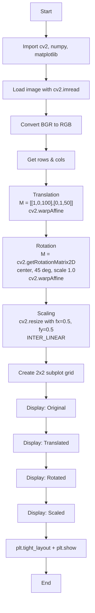

# CV Assignment 2 - Geometric Transformations: Translation, Rotation & Scaling

## Assignment Objective

Demonstrate translation, rotation, and scaling of an image using mathematical foundations such as matrices and coordinate transformation principles in geometric transformations.

---

## Theory

### What are Geometric Transformations?

Geometric transformations modify the spatial relationships between pixels in an image. Instead of changing pixel *values*, they change pixel *positions*. This is achieved through **transformation matrices** that map input coordinates to output coordinates.

### Coordinate Systems & Image Representation

An image is a 2D grid of pixels. Each pixel at position `(x, y)` holds intensity or color values. A geometric transformation computes a new location `(x', y')` for every original pixel:

```
(x', y') = T(x, y)
```

### 1. Translation

Translation shifts every pixel by a fixed offset without rotation or distortion.

```
x' = x + tx
y' = y + ty
```

**Matrix form (2×3 affine matrix used by OpenCV):**

```
T = [ [1, 0, tx],
      [0, 1, ty] ]
```

In this assignment, the image is translated **100 pixels right** (`tx = 100`) and **50 pixels down** (`ty = 50`). Areas shifted into the frame from outside appear black.

### 2. Rotation

Rotation turns the image around a pivot point (usually the image center) by a given angle.

```
x' = x·cos(θ) - y·sin(θ)
y' = x·sin(θ) + y·cos(θ)
```

**Matrix form:**

```
R(θ) = [ [cos(θ), -sin(θ)],
         [sin(θ),  cos(θ)] ]
```

In this assignment, the image is rotated by **45°** around its center with a scale factor of **1.0** (no additional scaling). The function `cv2.getRotationMatrix2D()` computes the 2×3 affine matrix directly, handling the translation needed to rotate around the center rather than the origin.

### 3. Scaling

Scaling enlarges or shrinks the image along the x and y axes.

```
x' = sx · x
y' = sy · y
```

**Matrix form:**

```
S = [ [sx, 0],
      [0, sy] ]
```

In this assignment, the image is scaled down by **0.5×** in both directions using bilinear interpolation.

### Key Properties of Affine Transformations

- Preserve **collinearity**: points on a line stay on a line
- Preserve **parallelism**: parallel lines stay parallel
- Preserve **ratios of distances** along a line

---

## Code Explanation

### Step 1: Import Libraries

```python
import cv2
import numpy as np
import matplotlib.pyplot as plt
```

- `cv2` (OpenCV): image processing and geometric transformation functions
- `numpy`: matrix operations and array manipulation
- `matplotlib.pyplot`: display images in a grid

### Step 2: Load & Convert Image

```python
image = cv2.imread('BMW.jpeg')
image_rgb = cv2.cvtColor(image, cv2.COLOR_BGR2RGB)
```

`cv2.imread()` loads the image in **BGR** format by default. `cv2.cvtColor()` converts it to **RGB** so Matplotlib displays the correct colors.

```python
rows, cols = image_rgb.shape[:2]
```

Extracts the image height (`rows`) and width (`cols`) for later use in transformation matrices and output sizes.

### Step 3: Translation

```python
tx, ty = 100, 50
translation_matrix = np.float32([[1, 0, tx], [0, 1, ty]])
translated_img = cv2.warpAffine(image_rgb, translation_matrix, (cols, rows))
```

Creates a 2×3 affine matrix that shifts every pixel 100px right and 50px down. `cv2.warpAffine()` applies this matrix to the image. The output size `(cols, rows)` matches the original, so shifted-in areas from outside appear black.

### Step 4: Rotation

```python
center = (cols / 2, rows / 2)
angle = 45
rotation_matrix = cv2.getRotationMatrix2D(center, angle, 1.0)
rotated_img = cv2.warpAffine(image_rgb, rotation_matrix, (cols, rows))
```

`cv2.getRotationMatrix2D()` computes the 2×3 affine matrix for rotation around the image center by 45° with scale 1.0. It internally translates to the center, rotates, then translates back. `cv2.warpAffine()` applies the transformation.

### Step 5: Scaling

```python
sx, sy = 0.5, 0.5
scaled_img = cv2.resize(image_rgb, None, fx=sx, fy=sy, interpolation=cv2.INTER_LINEAR)
```

Scales the image to 50% of its original width and height. `cv2.resize()` with `fx=0.5, fy=0.5` reduces the output size. `INTER_LINEAR` performs bilinear interpolation for smooth results.

### Step 6: Display Results

```python
plt.figure(figsize=(12, 8))

plt.subplot(2, 2, 1)
plt.imshow(image_rgb)
plt.title('Original Image')
plt.axis('off')

plt.subplot(2, 2, 2)
plt.imshow(translated_img)
plt.title('Translated Image (tx=100, ty=50)')
plt.axis('off')

plt.subplot(2, 2, 3)
plt.imshow(rotated_img)
plt.title('Rotated Image (45 degrees)')
plt.axis('off')

plt.subplot(2, 2, 4)
plt.imshow(scaled_img)
plt.title('Scaled Image (0.5x)')
plt.axis('off')

plt.tight_layout()
plt.show()
```

Creates a 2×2 subplot grid displaying the original and three transformed images side by side with titles. `plt.axis('off')` removes axis ticks. `plt.tight_layout()` adjusts spacing to prevent overlap.

---

## Program Flow



---

## Viva / Important Questions and Answers

### Q1: What is an affine transformation?

An affine transformation is a geometric transformation that preserves collinearity and ratios of distances. It can represent translation, rotation, scaling, and shearing as matrix operations on coordinates.

### Q2: Why do we convert BGR to RGB before displaying with Matplotlib?

OpenCV loads images in BGR format by default, while Matplotlib expects RGB. Without conversion, the red and blue channels would appear swapped, producing incorrect colors.

### Q3: What is the mathematical matrix for translation, and how is it constructed in the code?

Translation matrix:

```
T = [[1, 0, tx],
     [0, 1, ty]]
```

In the code: `np.float32([[1, 0, 100], [0, 1, 50]])` where `tx=100` and `ty=50`.

### Q4: How does `cv2.getRotationMatrix2D` work internally?

It computes a 2×3 affine matrix that first translates the image center to the origin, applies rotation by the given angle, and then translates back. This ensures rotation happens around the specified center point, not the top-left origin.

### Q5: Why is the output size `(cols, rows)` passed to `cv2.warpAffine`?

It defines the dimensions of the output image. Using the original `(cols, rows)` keeps the image size the same after transformation, with areas moved outside appearing black (or filled based on `borderMode`).

### Q6: What is the difference between `cv2.warpAffine` and `cv2.resize`?

`cv2.warpAffine` applies an arbitrary affine transformation matrix (translation, rotation, scaling, shearing). `cv2.resize` only resizes the image to specified dimensions using interpolation. For pure scaling, `cv2.resize` is simpler and more efficient.

### Q7: What does `INTER_LINEAR` interpolation do in `cv2.resize`?

It uses bilinear interpolation to compute pixel values at non-integer coordinates. For each output pixel, it samples the 4 nearest input pixels and computes a weighted average, producing smoother results than nearest-neighbor interpolation.

### Q8: Why is `np.float32` used for the transformation matrix?

OpenCV expects 32-bit floating-point matrices for affine transformations. This precision supports sub-pixel interpolation and ensures accurate geometric computations during warping.

### Q9: What is the effect of rotation by 45 degrees around the image center?

The image is rotated counter-clockwise by 45°. Corners of the original image move toward the center, and new areas enter from outside the original boundaries. These new areas appear black because `cv2.warpAffine` defaults to `BORDER_CONSTANT` with value 0.

### Q10: Why does the scaled image appear smaller in the subplot, and how does Matplotlib handle it?

The scaled image has half the pixel dimensions (0.5× width and height). Matplotlib's `imshow` displays it at its native pixel size within the subplot cell, making it appear smaller than the original. Matplotlib does not automatically upscale it to fill the cell unless `aspect` or interpolation settings are changed.

### Q11: Can affine transformations warp a rectangle into an arbitrary quadrilateral?

No. Affine transformations preserve parallelism, so a rectangle can only become a parallelogram. To warp into a general quadrilateral, you need a **perspective (projective) transformation** using `cv2.getPerspectiveTransform`.

### Q12: What happens if the image fails to load (e.g., wrong path)?

`cv2.imread()` returns `None`. Calling `.shape` on `None` raises an `AttributeError`, and `cv2.cvtColor()` raises an OpenCV assertion error. The code should ideally check if `image is None` and handle the error gracefully.

---

## Requirements

- Python 3.x
- OpenCV (`opencv-python`)
- NumPy
- Matplotlib

## How to Run

1. Ensure `BMW.jpeg` is in the same directory as `Ass2.ipynb`
2. Run the notebook cells sequentially in Jupyter Notebook / JupyterLab / VS Code
3. The output will display a 2×2 grid showing the original, translated, rotated, and scaled images
