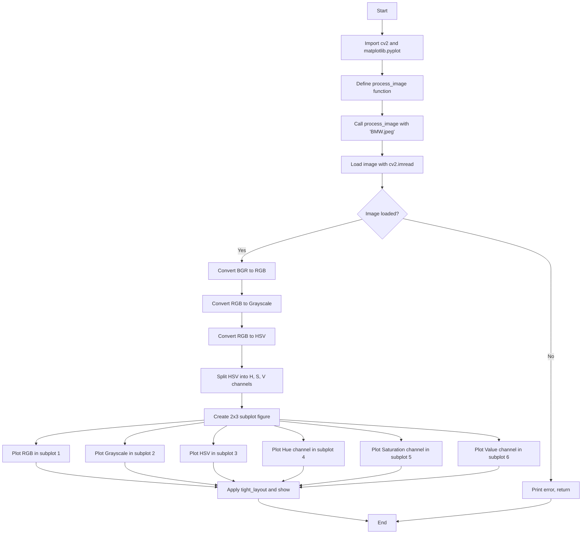

# CV Assignment 3: Color Space Conversions

This assignment demonstrates loading an image and converting it between various color spaces using OpenCV, then visualizing the results with matplotlib.

## Theory

### Color Spaces

A **color space** defines how colors can be represented and be visualized. Different color spaces present data in different ways and are suited for different tasks.

#### 1. BGR (Blue Green Red)

OpenCV loads images by default in the **BGR** format, where the channels are ordered as Blue, Green, Red. This is the reverse of the more commonly used RGB format. The ordering matters when interfacing between OpenCV and other libraries like matplotlib, PIL, or web-based display systems.

#### 2. RGB (Red Green Blue)

**RGB** is an additive color model in which red, green, and blue light are added together in various ways to reproduce a broad array of colors. Each channel typically has values ranging from 0 to 255 (for 8-bit images).

#### 3. Grayscale (Intensity)

A **grayscale** image represents the luminance (intensity) of the original image. Each pixel carries a single value representing the intensity of light, typically ranging from 0 (black) to 255 (white). Conversion to grayscale reduces dimensionality from 3 channels to 1, which is useful for reducing computational cost and simplifying algorithms such as edge detection or thresholding.

#### 4. HSV (Hue Saturation Value)

**HSV** is a cylindrical representation of points in an RGB color model, often used by people to specify color in a more perceptually relevant way. The three components are:

- **Hue (H)** — The color type (red, green, blue, etc.), represented as an angle in the range [0, 179] (OpenCV's normalized range).
- **Saturation (S)** — The purity or vividness of the color, ranging from 0 (grayscale) to 255.
- **Value (V)** — The brightness of the color, ranging from 0 (black) to 255.

HSV is particularly useful for tasks like color-based segmentation, because it separates color information from intensity, making it robust to lighting variations.

## Code Explanation

The notebook defines a single function, `process_image`, which performs all the conversions and visualizations:

### Step 1: Imports

```python
import cv2
import matplotlib.pyplot as plt
```

- **cv2** — OpenCV's Python module used for image loading, color space conversion, and channel manipulation.
- **matplotlib.pyplot** — Used for displaying images in a subplot grid.

### Step 2: `process_image` Function

```python
def process_image(image_path):
```

Accepts the file path of an image as input.

#### Loading the Image

```python
image_bgr = cv2.imread(image_path)
```

`cv2.imread()` reads the image file. OpenCV returns the image in **BGR** format by default, **not RGB**. This is a crucial detail because matplotlib expects **RGB** order, and if this conversion is skipped the colors will appear swapped (reds and blues inverted).

#### Error Check

```python
if image_bgr is None:
    print("Error: Could not load the image. Please check the file path.")
    return
```

If `cv2.imread()` cannot find or read the file, it returns `None`. This guard prevents a crash and notifies the user.

#### BGR → RGB Conversion

```python
image_rgb = cv2.cvtColor(image_bgr, cv2.COLOR_BGR2RGB)
```

Reorders the channels so the image displays correctly in matplotlib. `cvtColor` is the general-purpose color conversion function; the flag `COLOR_BGR2RGB` specifies the source and destination.

#### RGB → Grayscale Conversion

```python
image_gray = cv2.cvtColor(image_rgb, cv2.COLOR_RGB2GRAY)
```

Uses the standard luminance weighting: `Gray = 0.299*R + 0.587*G + 0.114*B`. The weights reflect the human eye's sensitivity to each primary color — green appears brightest to us, red less so, blue least.

#### RGB → HSV Conversion

```python
image_hsv = cv2.cvtColor(image_rgb, cv2.COLOR_RGB2HSV)
```

Converts the image to the HSV cylindrical color space. OpenCV uses a normalized hue range of [0, 179] (8-bit), so angles that normally span [0, 360] degrees are halved.

#### Splitting HSV Channels

```python
h_channel, s_channel, v_channel = cv2.split(image_hsv)
```

`cv2.split()` separates the multi-channel HSV image into three single-channel 2D arrays, one per component (Hue, Saturation, Value).

### Displaying Results

```python
plt.figure(figsize=(12, 8))
plt.subplot(2, 3, 1)
...
plt.subplot(2, 3, 6)
...
plt.tight_layout()
plt.show()
```

A **2×3 subplot grid** is created:

| Position | Content | Colormap |
|----------|---------|----------|
| (1,1) — subplot 1 | Original RGB image | Default (RGB) |
| (1,2) — subplot 2 | Grayscale | `cmap='gray'` |
| (1,3) — subplot 3 | HSV (shown as RGB for structural comparison) | Default |
| (2,1) — subplot 4 | Hue channel | `cmap='gray'` |
| (2,2) — subplot 5 | Saturation channel | `cmap='gray'` |
| (2,3) — subplot 6 | Value channel | `cmap='gray'` |

`plt.axis('off')` removes tick marks and axes for a clean viewer. `tight_layout()` adjusts spacing so titles and images do not overlap.

### Entry Point

```python
process_image('BMW.jpeg')
```

Calls the function on the sample `BMW.jpeg` file in the same directory.

## Program Flow



## Frequently Asked Questions

### Q1: Why does OpenCV use BGR instead of RGB?

OpenCV was originally designed when many cameras and frame grabbers produced BGR-ordered data. The convention stuck, so `cv2.imread()` returns images in BGR. When displaying with matplotlib (which expects RGB), a conversion is necessary to avoid color-swapping artifacts.

### Q2: What is the difference between Grayscale and the HSV Value channel?

Grayscale is computed as a weighted sum of the RGB channels (`0.299R + 0.587G + 0.114B`). The HSV **Value** channel represents the brightness of the *brightest* contributing primary color and can differ visually from grayscale, especially in highly saturated regions.

### Q3: Why is the Hue range [0, 179] in OpenCV?

OpenCV uses 8-bit unsigned integers (0–255) for channel storage. Since hue is an angle (0°–360°), OpenCV halves the values to fit within 8 bits: 0° maps to 0 and 360° maps to 179 (actually 180). This allows two full hue cycles to be stored if needed, but in standard RGB→HSV conversion the range is [0, 179].

### Q4: When would I use HSV over RGB?

HSV is preferred when you need to reason about **color** as a human would — for example, isolating "red objects" in a video stream regardless of lighting. Since saturation and value are separated from hue, you can threshold on hue alone and be largely immune to shadows or exposure changes.

### Q5: What happens if I forget to convert BGR to RGB before displaying?

The image will appear with **red and blue channels swapped**, giving it an unnatural purple/green tint. Faces look especially distorted, and any color-based thresholding will fail because the colors are wrong.

### Q6: How does `cv2.split()` work?

`cv2.split()` takes a multi-channel array (e.g., a 3-channel HSV image) and returns a **list/tuple** of single-channel arrays. Each element is a 2D array representing one channel. This is the inverse of `cv2.merge()`.

### Q7: Can I convert directly from BGR to Grayscale or HSV?

Yes. OpenCV allows `cv2.COLOR_BGR2GRAY` and `cv2.COLOR_BGR2HSV`, skipping the intermediate RGB step. The result is identical for grayscale. For HSV, converting from BGR directly is also valid and slightly more efficient.

### Q8: Why use `cmap='gray'` for single-channel images in matplotlib?

Single-channel arrays have no inherent color information. By default matplotlib may render them using the `viridis` colormap (purple-to-yellow). Specifying `cmap='gray'` renders them as a proper grayscale image, which is the expected and meaningful visualization for intensity data.

### Q9: What does `plt.tight_layout()` do?

It automatically adjusts subplot parameter spacing to ensure that titles, labels, and images do not overlap. Without it, long titles or many subplots can cause clipping or overlapping elements.

### Q10: What file formats can `cv2.imread()` read?

OpenCV supports **JPEG, PNG, BMP, TIFF, WebP**, and others. The supported formats depend on how OpenCV was built (the image codecs compiled in). Reading always produces a **NumPy ndarray** in BGR order for color images.

## Files

| File | Description |
|------|-------------|
| `Ass3.ipynb` | Jupyter notebook implementing the color space conversion pipeline. |
| `BMW.jpeg` | Sample input image (a BMW car). |
| `output.png` | Captured output of the visualization. |
| `README.md` | This documentation. |
