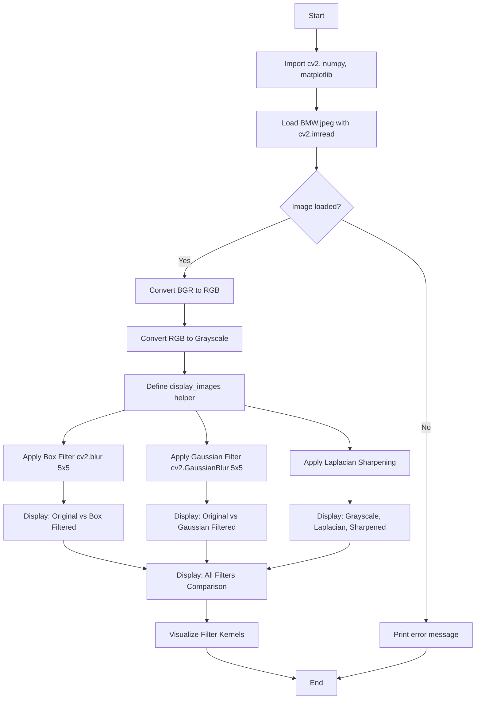

# CV Assignment 4: Spatial Domain Filtering

This assignment demonstrates **smoothing** and **sharpening** filtering in the spatial domain using OpenCV. The effects of a **Box Filter**, **Gaussian Filter**, and **Laplacian Sharpening Filter** are applied to an input image and visualized side by side.

---

## Theory

# Spatial Domain Filtering

## Overview
Spatial domain filtering operates directly on the pixel values of an image. A filter (also commonly referred to as a kernel or mask) is applied to each individual pixel by computing a weighted sum of the pixel values within a specific neighborhood around that target pixel. The result of this process is a newly transformed image.

## Mathematical Formulation
The general form of linear spatial filtering is defined by the following equation:

$$g(x, y) = \sum_{s=-a}^{a} \sum_{t=-b}^{b} w(s, t) f(x + s, y + t)$$

*(Note: For a kernel of size $m \times n$, the limits are typically defined as $a = (m-1)/2$ and $b = (n-1)/2$.)*

## Variables

*   $f(x, y)$: The input image (original pixel values).
*   $g(x, y)$: The output image (transformed pixel values).
*   $w(s, t)$: The filter kernel or weight matrix applied to the neighborhood.
*   $s, t$: The spatial coordinates within the filter kernel.

### Smoothing Filters

Smoothing filters are used for **blurring** and **noise reduction**. They work by averaging (or weighted averaging) pixel values in a local neighborhood, which suppresses high-frequency variations (noise) at the cost of losing fine detail.

#### 1. Box Filter (Averaging Filter)

The box filter replaces each pixel with the **unweighted average** of all pixels within the kernel window. For a $k \times k$ kernel, the weights are defined as:

$$w(s, t) = \frac{1}{k^2}$$

*for all $(s, t)$ within the kernel neighborhood.*

Every pixel in the neighborhood contributes equally. This is the simplest smoothing filter, but it tends to blur edges along with noise.

#### 2. Gaussian Filter

The Gaussian filter performs a **weighted average** where the weights are determined by a 2D Gaussian function:

$$G(x, y) = \frac{1}{2\pi\sigma^2} \exp\left(-\frac{x^2 + y^2}{2\sigma^2}\right)$$

- Pixels closer to the center receive **higher weights**.
- Pixels farther from the center receive **lower weights**.
- $\sigma$ (sigma) controls the spread of the Gaussian — larger $\sigma$ produces more blurring.
- When `sigmaX=0`, OpenCV computes $\sigma$ from the kernel size automatically.

The Gaussian filter is **separable**, meaning the 2D convolution can be performed as two 1D convolutions (horizontal then vertical), making it computationally efficient.

### Sharpening Filters

Sharpening filters enhance edges and fine details by emphasizing high-frequency components. They are based on **second-order derivatives**.

#### Laplacian Filter

The Laplacian is a second-order derivative operator that detects regions of rapid intensity change:

$$\nabla^2 f = \frac{\partial^2 f}{\partial x^2} + \frac{\partial^2 f}{\partial y^2}$$

In discrete form, a common 3×3 Laplacian kernel is:

$$
\begin{bmatrix}
 0 &  1 & 0 \\
 1 & -4 & 1 \\
 0 &  1 & 0
\end{bmatrix}
$$

Sharpening is achieved by **adding** the Laplacian back to the original image:

$$\text{sharpened} = \text{original} - \alpha \cdot \text{laplacian}$$

or equivalently using `cv2.addWeighted`:

```python
sharpened = cv2.addWeighted(original, 1.5, laplacian, -0.5, 0)
```

This enhances edges by increasing the contrast at intensity transitions.

---

## Code Explanation (Cell by Cell)

### Cell 1: Imports

```python
import cv2
import numpy as np
import matplotlib.pyplot as plt
```

- **cv2** — OpenCV's Python module for image loading, filtering, and color conversion.
- **numpy** — Used for array manipulation, kernel creation, and numerical operations.
- **matplotlib.pyplot** — Used for displaying images in subplot grids.

### Cell 2: Load Image and Define Helper

```python
image_bgr = cv2.imread('BMW.jpeg')

if image_bgr is None:
    print('Error: Could not load the image. Please check the file path.')
else:
    image_rgb = cv2.cvtColor(image_bgr, cv2.COLOR_BGR2RGB)
    image_gray = cv2.cvtColor(image_rgb, cv2.COLOR_RGB2GRAY)
    print(f'Image loaded successfully. Shape: {image_rgb.shape}')
```

- `cv2.imread()` loads the image in **BGR** format (OpenCV's default).
- The `None` check prevents crashes if the file path is incorrect.
- `cv2.cvtColor(image_bgr, cv2.COLOR_BGR2RGB)` converts to RGB for correct display in matplotlib.
- `cv2.cvtColor(image_rgb, cv2.COLOR_RGB2GRAY)` converts to grayscale for sharpening (Laplacian operates on single-channel images).

```python
def display_images(images, titles, cols=3, figsize=(18, 6)):
    rows = int(np.ceil(len(images) / cols))
    plt.figure(figsize=figsize)
    for i in range(len(images)):
        plt.subplot(rows, cols, i + 1)
        if len(images[i].shape) == 2:
            plt.imshow(images[i], cmap='gray')
        else:
            plt.imshow(images[i])
        plt.title(titles[i])
        plt.axis('off')
    plt.tight_layout()
    plt.show()
```

A reusable helper function that takes a list of images and titles, arranges them in a subplot grid, and displays them. It automatically uses grayscale colormap for single-channel images.

### Cell 3: Box Filter (Smoothing)

```python
box_filtered = cv2.blur(image_rgb, (5, 5))
```

`cv2.blur()` applies a **box filter** (normalized box filter) with a `5×5` kernel. Every pixel in the `5×5` neighborhood contributes equally (weight = `1/25`). This smooths the image and reduces noise but also blurs edges.

### Cell 4: Gaussian Filter (Smoothing)

```python
gaussian_filtered = cv2.GaussianBlur(image_rgb, (5, 5), sigmaX=0)
```

`cv2.GaussianBlur()` applies a **Gaussian filter** with a `5×5` kernel. When `sigmaX=0`, OpenCV computes the standard deviation from the kernel size (`σ = 0.3 * ((ksize-1)*0.5 - 1) + 0.8`). The Gaussian kernel gives more weight to the center pixel and less to peripheral pixels, producing a smoother, more natural blur than the box filter.

### Cell 5: Sharpening Filter (Laplacian)

```python
laplacian = cv2.Laplacian(image_gray, cv2.CV_64F)
laplacian_uint8 = np.uint8(np.absolute(laplacian))
```

`cv2.Laplacian()` computes the Laplacian (second derivative) of the grayscale image. The output depth `cv2.CV_64F` (64-bit float) is used to avoid overflow since the Laplacian can produce negative values. `np.absolute()` takes the absolute value and `np.uint8()` converts back to 8-bit for display.

```python
sharpened = cv2.addWeighted(image_gray, 1.5, laplacian_uint8, -0.5, 0)
```

`cv2.addWeighted()` computes: `sharpened = 1.5 * image_gray + (-0.5) * laplacian_uint8 + 0`. The original image is amplified (1.5×) and the Laplacian is subtracted (-0.5×), which enhances edges by increasing contrast at intensity transitions.

### Cell 6: Combined Comparison

```python
display_images(
    [image_rgb, box_filtered, gaussian_filtered, image_gray, sharpened],
    ['Original RGB', 'Box Filter (5x5)', 'Gaussian Filter (5x5)', 'Grayscale', 'Sharpened (Laplacian)'],
    cols=5
)
```

Displays all five results in a single row for direct visual comparison of the original image, both smoothing filters, the grayscale version, and the sharpened result.

### Cell 7: Filter Kernels Visualization

```python
box_kernel = np.ones((5, 5), np.float32) / 25
gaussian_kernel = cv2.getGaussianKernel(5, sigma=0) @ cv2.getGaussianKernel(5, sigma=0).T
```

Visualizes the actual kernel matrices used by each filter. The box kernel is uniform (all `1/25`). The Gaussian kernel is computed as the outer product of two 1D Gaussian vectors, producing a bell-shaped weight distribution. The Laplacian kernel is defined explicitly as a 3×3 matrix.

### Cell 8: Explanation of Filters

A markdown cell summarizing the purpose, behavior, and trade-offs of each filter type.

---

## Program Flow



---

## Files

| File | Description |
|------|-------------|
| `assignment4.ipynb` | Jupyter notebook implementing spatial domain filtering (Box, Gaussian, Sharpening). |
| `BMW.jpeg` | Sample input image used for filtering demonstrations. |
| `README.md` | This documentation file. |

---

## Frequently Asked Questions

### Q1: What is the difference between a Box Filter and a Gaussian Filter?

A box filter uses **uniform weights** (every pixel in the kernel has equal weight), while a Gaussian filter uses **weighted averages** where the center pixel has the highest weight and weights decrease with distance. The Gaussian filter produces a more natural blur and preserves edges better than the box filter.

### Q2: Why is the Laplacian filter called a second-order derivative operator?

The Laplacian computes the **second derivative** of the image intensity function (`∂²f/∂x² + ∂²f/∂y²`). While first-order derivatives (like Sobel) detect edges as maxima in the gradient, the second derivative detects edges as **zero-crossings** and highlights regions of rapid intensity change.

### Q3: Why do we convert the image to grayscale before applying the Laplacian?

The Laplacian computes derivatives, which are mathematically defined for single-channel (scalar) images. Applying it to a 3-channel color image would produce a 3-channel result where edges from each channel are computed independently, which is rarely meaningful. Grayscale provides a single intensity channel that represents luminance.

### Q4: What is the purpose of `cv2.CV_64F` in `cv2.Laplacian()`?

`cv2.CV_64F` specifies the output image depth as 64-bit floating point. The Laplacian can produce negative values (for dark-to-light transitions) and values larger than 255 (for strong edges). Using `int8` or `uint8` would cause overflow and clipping, losing edge information.

### Q5: What happens when `sigmaX=0` in `cv2.GaussianBlur()`?

When `sigmaX=0`, OpenCV automatically computes the standard deviation from the kernel size using the formula: `σ = 0.3 * ((ksize - 1) * 0.5 - 1) + 0.8`. For a `5×5` kernel, this results in `σ ≈ 0.8`.

### Q6: How does `cv2.addWeighted()` work for sharpening?

`cv2.addWeighted(src1, alpha, src2, beta, gamma)` computes: `result = alpha * src1 + beta * src2 + gamma`. For sharpening, `src1` is the original image (alpha=1.5), `src2` is the Laplacian (beta=-0.5), and gamma=0. This amplifies the original and subtracts the edges, enhancing contrast at boundaries.

### Q7: Why does the box filter blur edges more than the Gaussian filter?

The box filter assigns **equal weight** to all pixels in the kernel, including those across an edge. This causes edge pixels to be averaged with pixels from the other side of the edge, smearing the transition. The Gaussian filter assigns **lower weights** to distant pixels, so pixels across an edge contribute less, preserving the edge better.

### Q8: Can spatial domain filters be applied to color images directly?

Yes. `cv2.blur()` and `cv2.GaussianBlur()` operate on all channels independently when given a 3-channel image. However, this can cause **cross-channel artifacts** at color boundaries. For more accurate results, it is common to convert to a perceptually uniform color space (like LAB) and filter only the luminance channel.

### Q9: What is the effect of increasing the kernel size?

Increasing the kernel size increases the **neighborhood** over which pixels are averaged, resulting in **more blurring** (for smoothing filters) or **more edge enhancement** (for sharpening). However, larger kernels also increase computation time and can remove fine details entirely.

### Q10: What is the relationship between spatial domain filtering and frequency domain filtering?

Spatial domain filtering (convolution with a kernel) is equivalent to **multiplication in the frequency domain** (by the Fourier transform of the kernel). Smoothing filters act as **low-pass filters** (they pass low frequencies and attenuate high frequencies). Sharpening filters act as **high-pass filters** (they pass high frequencies and attenuate low frequencies). The Gaussian kernel's Fourier transform is also a Gaussian, making it a smooth low-pass filter with no ringing artifacts.