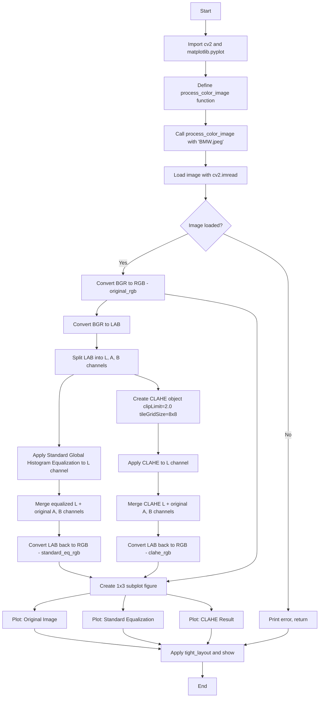

# CV Assignment 5: Histogram Equalization and CLAHE in LAB Color Space

This assignment demonstrates **histogram equalization** techniques for contrast enhancement. It compares **Standard Global Histogram Equalization** with **CLAHE (Contrast Limited Adaptive Histogram Equalization)**, both applied to the luminance (L) channel of the **LAB** color space. Equalizing only the L channel enhances contrast while preserving the original color information (A and B channels), avoiding the color distortion that occurs when equalizing RGB channels directly.

---

## Theory

### What is Histogram Equalization?

A **histogram** of an image represents the distribution of pixel intensities. For an 8-bit grayscale image, the histogram has 256 bins (0–255), where each bin counts how many pixels have that intensity value. **Histogram equalization** is a technique that redistributes pixel intensities so that the output histogram is more uniformly distributed (flattened). This spreads out the most frequent intensity values, enhancing global contrast — especially in images where the brightness levels are too narrow (e.g., overexposed or underexposed regions).

### Why LAB Color Space?

The **LAB** (or CIE L\*a\*b\*) color space separates luminance from color information:

- **L channel (Lightness):** Represents the brightness of the pixel, ranging from 0 (black) to 255 (white).
- **A channel (Green–Red axis):** Negative values lean toward green, positive values toward red.
- **B channel (Blue–Yellow axis):** Negative values lean toward blue, positive values toward yellow.

This separation is critical for histogram equalization. If we equalize each channel of an RGB image independently, the relative relationships between color channels are destroyed, leading to **color shifts** and unrealistic color artifacts. By equalizing only the **L channel** and merging it back with the unchanged A and B channels, we achieve contrast enhancement while **preserving natural color balance**.

### 1. Standard Global Histogram Equalization

**Global** histogram equalization computes a single transformation function from the **entire** image histogram and applies it uniformly to every pixel.

The transformation is based on the **Cumulative Distribution Function (CDF)** of the input histogram:

$$s_k = (n - 1) \cdot \sum_{j=0}^{k} \frac{h(j)}{N}$$

Where:

- $h(j)$: the histogram count at intensity level $j$
- $N$: total number of pixels in the image
- $n$: number of possible intensity levels (256 for 8-bit)
- $s_k$: the new intensity value for pixels with original intensity $k$

This "stretches" the intensity range, mapping the darkest values to 0 and the brightest to 255, effectively producing a full-tone image.

**Limitations of global equalization:**

- It applies the same transformation everywhere, so it cannot handle **locally dim** or **locally bright** regions in the same image.
- It tends to **over-amplify noise** in near-constant regions because it forces the histogram to be flat.
- It can produce an image with **unnaturally high contrast** ("washed out" appearance).

In OpenCV, this is performed with `cv2.equalizeHist()`, a single call that applies the CDF-based transformation to a single-channel image.

### 2. CLAHE — Contrast Limited Adaptive Histogram Equalization

**CLAHE** improves upon global equalization by dividing the image into a grid of **contextual regions** (tiles) and applying histogram equalization to each tile independently.

#### How CLAHE works:

1. **Tiling:** The image is divided into small tiles (e.g., the default tile grid is $8 \times 8$ in this assignment).
2. **Per-tile equalization:** Histogram equalization is applied to each tile individually, computing a local CDF.
3. **Contrast limiting (clipping):** Each histogram bin is capped at a threshold (`clipLimit`). If any bin exceeds this value, the excess counts are redistributed to neighboring bins. This prevents over-amplification of noise — the key difference from plain adaptive equalization.
4. **Interpolation:** The transformed tiles are combined using **bilinear interpolation** to eliminate visible tile boundary artifacts ("blocky" or "tiled" appearance).

#### Key CLAHE parameters:

- **`clipLimit`** (in this assignment: `2.0`): The threshold for contrast limiting. A lower value produces less contrast (and less noise amplification); a higher value produces more contrast but can amplify noise.
- **`tileGridSize`** (in this assignment: `(8, 8)`): The number of tiles in the grid. Smaller tiles enhance local details more but increase tile artifacts; larger tiles approach the behavior of global equalization.

In OpenCV, CLAHE is created with `cv2.createCLAHE()` and applied to a single-channel image using `.apply()`.

### Comparison Summary

| Property | Standard Global Equalization | CLAHE |
|---|---|---|
| Scope | Entire image (one CDF) | Per-tile (local CDFs) |
| Noise amplification | High | Controlled by clip limit |
| Local contrast | Uniform everywhere | Enhanced per region |
| Tile boundary artifacts | None | Eliminated by interpolation |
| Best use case | Low-contrast, evenly lit images | Images with varying local illumination |

---

## Code Explanation (Cell by Cell)

### Cell 1: Imports

```python
import cv2
import matplotlib.pyplot as plt
```

- **cv2** — OpenCV's Python module for image loading, color space conversion, channel manipulation, and histogram processing.
- **matplotlib.pyplot** — Used for displaying images in a subplot grid.

### Cell 2: `process_color_image` Function — Structure

```python
def process_color_image(image_path):
```

The entire pipeline is wrapped in a single function that accepts an image file path as input and runs all processing and visualization steps.

#### Reading the Image

```python
bgr_img = cv2.imread(image_path)
```

`cv2.imread()` loads the image file. OpenCV returns the image in **BGR** format by default (Blue, Green, Red), which is the opposite of the RGB order expected by most display libraries.

#### Error Handling

```python
if bgr_img is None:
    print("Error: Could not load image. Check the file path.")
    return
```

If `cv2.imread()` cannot find or read the file, it returns `None`. This guard prevents a crash and notifies the user of the problem.

#### BGR → RGB Conversion

```python
original_rgb = cv2.cvtColor(bgr_img, cv2.COLOR_BGR2RGB)
```

Reorders the channels so the image displays correctly in Matplotlib. `cv2.cvtColor()` is the general-purpose color conversion function; the flag `COLOR_BGR2RGB` specifies the source and destination.

### Cell 3: LAB Color Space Conversion

```python
lab_img = cv2.cvtColor(bgr_img, cv2.COLOR_BGR2LAB)
```

Converts the BGR image to the **LAB** color space. In LAB, the **L** channel (lightness) is separated from the **A** (green–red) and **B** (blue–yellow) channels. This separation allows us to enhance contrast in the luminance channel without affecting color.

### Cell 4: Splitting LAB Channels

```python
l_channel, a_channel, b_channel = cv2.split(lab_img)
```

`cv2.split()` separates the 3-channel LAB image into three single-channel 2D arrays: the **L** (lightness) channel, the **A** channel, and the **B** channel.

### Step 5: Standard Global Histogram Equalization

```python
l_eq = cv2.equalizeHist(l_channel)
```

`cv2.equalizeHist()` applies global histogram equalization to the L channel only. It computes the CDF of the L-channel histogram and maps all pixels through it, stretching the contrast to cover the full 0–255 range.

#### Merge and Convert Back

```python
lab_eq = cv2.merge((l_eq, a_channel, b_channel))
standard_eq_rgb = cv2.cvtColor(lab_eq, cv2.COLOR_LAB2RGB)
```

`cv2.merge()` combines the equalized L channel with the **original** (unchanged) A and B channels, reconstructing a 3-channel LAB image. `cv2.cvtColor()` then converts it back to RGB for display with Matplotlib.

### Step 6: CLAHE (Contrast Limited Adaptive Histogram Equalization)

```python
clahe = cv2.createCLAHE(clipLimit=2.0, tileGridSize=(8, 8))
```

Creates a CLAHE object with:

- **`clipLimit=2.0`**: the threshold for contrast limiting (prevents noise over-amplification).
- **`tileGridSize=(8, 8)`**: the image is tiled into an $8 \times 8$ grid, and equalization is applied per tile.

```python
l_clahe = clahe.apply(l_channel)
```

Applies the CLAHE transformation to the L channel. The resulting `l_clahe` array has the same shape as `l_channel` but with locally enhanced contrast.

#### Merge and Convert Back

```python
lab_clahe = cv2.merge((l_clahe, a_channel, b_channel))
clahe_rgb = cv2.cvtColor(lab_clahe, cv2.COLOR_LAB2RGB)
```

Same as above: merges the CLAHE-enhanced L channel with the original A and B channels, then converts back to RGB.

### Step 7: Visualization

```python
images = [original_rgb, standard_eq_rgb, clahe_rgb]
titles = ['Original Color Image', 'Standard Equalization', 'CLAHE (Adaptive)']

plt.figure(figsize=(15, 6))

for i in range(3):
    plt.subplot(1, 3, i+1)
    plt.imshow(images[i])
    plt.title(titles[i])
    plt.axis('off')

plt.tight_layout()
plt.show()
```

A **1×3 subplot grid** is created:

| Position | Content | Colormap |
|---|---|---|
| subplot 1 (1,3,1) | Original RGB image | Default (RGB) |
| subplot 2 (1,3,2) | Standard Equalization result | Default (RGB) |
| subplot 3 (1,3,3) | CLAHE result | Default (RGB) |

`plt.axis('off')` removes tick marks and axes for a clean display. `plt.tight_layout()` adjusts spacing so titles and images do not overlap.

### Entry Point

```python
process_color_image('BMW.jpeg')
```

Calls the function on the sample `BMW.jpeg` file in the same directory.

---

## Program Flow



---

## Files

| File | Description |
|------|-------------|
| `code.ipynb` | Jupyter notebook implementing histogram equalization (standard and CLAHE) in LAB color space. |
| `BMW.jpeg` | Sample input image (a BMW car). |
| `output.png` | Cached output visualization showing original, standard equalization, and CLAHE results. |
| `README.md` | This documentation. |

---

## Frequently Asked Questions

### Q1: Why use LAB color space instead of equalizing each RGB channel separately?

Equalizing each RGB channel independently destroys the relative relationships between channels, causing severe **color shifts** and unrealistic hues (e.g., skin tones become distorted). In LAB, the **L channel** represents luminance (brightness) while **A** and **B** represent color. Equalizing only L enhances contrast without altering color information, producing a natural-looking result.

### Q2: What does `cv2.equalizeHist()` do internally?

It computes the **Cumulative Distribution Function (CDF)** of the input image's histogram and uses it as a lookup table to remap pixel values. The CDF-based mapping ensures that the output histogram spans the full 0–255 range, effectively "flattening" the histogram and stretching contrast.

### Q3: Why is `clipLimit` important in CLAHE?

Without contrast limiting, local histogram equalization can amplify noise in near-constant regions (where the local histogram is very peaked). `clipLimit` caps each histogram bin at a maximum count; excess counts are redistributed to neighboring bins. This bounds the local contrast amplification factor, preventing unrealistic noise blow-up.

### Q4: What is the effect of `tileGridSize=(8, 8)`?

The image is divided into an $8 \times 8$ grid of tiles (64 tiles total for an $8 \times 8$ grid). Equalization is applied independently to each tile using its local histogram. Smaller tiles enhance finer local details but increase the risk of tile-boundary artifacts. Larger tiles approach the behavior of global histogram equalization. Bilinear interpolation between tiles eliminates visible block boundaries.

### Q5: Why do we convert back to RGB (LAB2RGB) after merging the channels?

OpenCV and Matplotlib use different color channel orderings. LAB2RGB conversion produces an image in RGB order, which Matplotlib's `imshow()` expects and displays correctly. We could also use LAB2BGR and then convert, but LAB2RGB is direct and avoids an extra step.

### Q6: What is the difference between standard histogram equalization and CLAHE?

Standard (global) histogram equalization computes one CDF from the entire image and applies the same mapping everywhere — it cannot handle locally dim or bright regions. CLAHE computes **local** CDFs per tile, enhancing contrast adaptively across the image. CLAHE also includes **clipping** to prevent noise over-amplification and **interpolation** to remove tile boundaries — features that standard equalization lacks.

### Q7: When would standard global equalization be preferred over CLAHE?

Standard global equalization is simpler and faster (single pass over the image). It is suitable when the image has a narrow intensity distribution (e.g., a foggy or backlit image with globally low contrast) and no significant local illumination variation. For images with mixed lighting conditions, CLAHE is generally superior.

### Q8: Why use `plt.tight_layout()` and `plt.axis('off')`?

`plt.axis('off')` removes axis ticks, labels, and borders, giving a clean image-only display suitable for presentations. `plt.tight_layout()` automatically adjusts subplot spacing to prevent titles and images from overlapping, which is especially important when using `figsize=(15, 6)` with three side-by-side subplots.

### Q9: Can CLAHE be applied to the A and B channels as well?

Yes, technically. However, equalizing the A and B channels independently can distort colors because those channels represent relative color information, not absolute intensity. It is standard practice to equalize only the **L channel** to preserve color fidelity.

### Q10: What is the relationship between histogram equalization and the CDF?

Histogram equalization uses the CDF as its **transformation function**. The CDF monotonically maps each input intensity to a new intensity such that the output histogram becomes approximately uniform. Mathematically, the CDF at value $k$ equals the probability that a pixel has intensity ≤ $k$, and this cumulative probability determines the remapped value. Because the CDF is monotonically increasing, the relative ordering of intensities is preserved while the distribution is spread out.