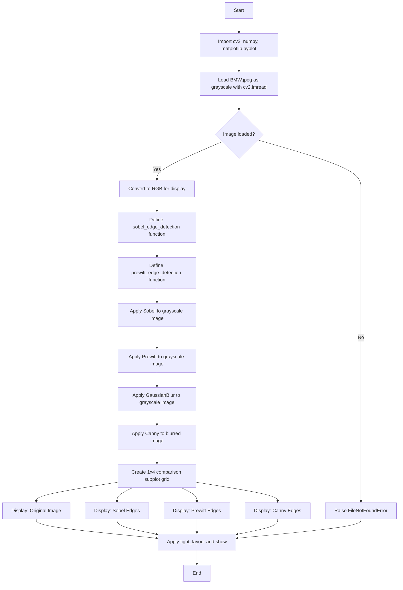

# CV Assignment 6: Edge Detection Operators (Sobel, Prewitt, Canny)

This assignment demonstrates **edge detection** using three classic operators to locate **object boundaries** in an image:

1. **Sobel Operator** — uses Sobel kernels to compute the horizontal and vertical gradients and combines them into a gradient magnitude map.
2. **Prewitt Operator** — uses Prewitt kernels to compute the horizontal and vertical gradients and combines them into a gradient magnitude map.
3. **Canny Detector** — a multi-stage edge detector that applies Gaussian blurring, gradient computation, non-maximum suppression, double thresholding, and hysteresis thresholding.

All techniques are applied to `BMW.jpeg` and the results are visualized alongside the original image for direct comparison.

---

## Theory

### What is Edge Detection?

**Edge detection** is a fundamental image processing technique that identifies sharp discontinuities in pixel intensity — these correspond to physical boundaries of objects in the scene. Mathematically, an edge is a set of connected pixels that form a ridge in the **first derivative** (or a zero-crossing in the **second derivative**) of the image intensity function.

### Why Use Kernels for Edge Detection?

Edge detection kernels (also called masks or filters) are small matrices that are convolved with the image to compute a **local approximation of the gradient** at each pixel. The gradient measures how quickly the intensity changes in the horizontal and vertical directions. Pixels with a large gradient magnitude are likely to lie on an edge.

### 1. Sobel Edge Detection

The Sobel operator uses two 3×3 kernels — one for detecting horizontal gradients (Gx) and one for detecting vertical gradients (Gy):

$$G_x = \begin{bmatrix} -1 & 0 & 1 \\ -2 & 0 & 2 \\ -1 & 0 & 1 \end{bmatrix}, \quad G_y = \begin{bmatrix} -1 & -2 & -1 \\ 0 & 0 & 0 \\ 1 & 2 & 1 \end{bmatrix}$$

The edge magnitude at each pixel is computed as:

$$|G| = \sqrt{G_x^2 + G_y^2}$$

In OpenCV, `cv2.Sobel(image, cv2.CV_64F, 1, 0)` computes the derivative in the x-direction and `cv2.Sobel(image, cv2.CV_64F, 0, 1)` computes the derivative in the y-direction. The `CV_64F` depth is used to avoid overflow from negative gradient values. The two gradient maps are then combined into a magnitude map.

**Why Sobel works:**
- The central row/column of zeros makes the kernel sensitive to intensity changes perpendicular to the kernel direction.
- The weighting (−2, 0, +2) gives more influence to central pixels, reducing noise sensitivity compared to operators with uniform weights.

### 2. Prewitt Edge Detection

The Prewitt operator uses two 3×3 kernels:

$$G_x = \begin{bmatrix} -1 & -1 & -1 \\ 0 & 0 & 0 \\ 1 & 1 & 1 \end{bmatrix}, \quad G_y = \begin{bmatrix} -1 & 0 & 1 \\ -1 & 0 & 1 \\ -1 & 0 & 1 \end{bmatrix}$$

Like Sobel, the edge magnitude is `sqrt(Gx² + Gy²)`. In OpenCV, `cv2.filter2D()` applies the custom Prewitt kernels to compute the gradients.

**Comparison with Sobel:**
- Prewitt uses **uniform weights** (−1 or +1) while Sobel uses **weighted values** (−2 or +2) in the central row/column.
- Prewitt is simpler but **more sensitive to noise**. Sobel provides slightly better noise suppression due to its weighted center row/column.

### 3. Canny Edge Detection

The Canny edge detector is a **multi-stage algorithm** designed to produce thin, accurate edge maps:

1. **Gaussian Blur** — A Gaussian filter is applied to reduce noise and smooth the image. This prevents false edges caused by pixel-level noise.
2. **Gradient Computation** — Sobel kernels are used to compute the gradient magnitude and direction (Gx, Gy) at each pixel.
3. **Non-Maximum Suppression** — For each pixel, the gradient is compared only with its two neighbors along the gradient direction. If the pixel is not a local maximum, it is suppressed (set to 0). This thins edges to a single pixel width.
4. **Double Thresholding** — Pixels are classified as:
   - **Strong edges** — gradient magnitude ≥ high threshold (definite edges)
   - **Weak edges** — low threshold ≤ magnitude < high threshold (possible edges)
   - **Non-edges** — magnitude < low threshold (discarded)
5. **Hysteresis** — Weak edge pixels are kept only if they are connected (8-connected) to a strong edge pixel. This removes isolated noise responses while preserving continuous edge contours.

In OpenCV, `cv2.Canny(image, low_threshold, high_threshold)` performs all stages automatically. The thresholds (100 and 200 in this assignment) control the trade-off between detecting all real edges and avoiding false positives.

---

## Code Explanation (Cell by Cell)

### Cell 1: Imports

```python
import cv2
import numpy as np
import matplotlib.pyplot as plt
```

- **cv2** — OpenCV's Python module for image loading, edge detection kernels, and filtering.
- **numpy** — Used for array manipulation, kernel creation (Prewitt), and gradient magnitude computation.
- **matplotlib.pyplot** — Used for displaying images and edge detection results in subplot grids.

### Cell 2: Load Image

```python
image_path = 'BMW.jpeg'

gray = cv2.imread(image_path, cv2.IMREAD_GRAYSCALE)
if gray is None:
    raise FileNotFoundError(f'Could not load image: {image_path}')

rgb = cv2.cvtColor(cv2.imread(image_path), cv2.COLOR_BGR2RGB)

plt.figure(figsize=(6, 4))
plt.imshow(rgb)
plt.title('Original Image (BMW.jpeg)')
plt.axis('off')
plt.show()
```

- `cv2.imread()` with `cv2.IMREAD_GRAYSCALE` loads the image as a single-channel grayscale image. Edge detection algorithms operate on intensity alone, so a grayscale image is sufficient and faster to process.
- The `None` check prevents crashes if the image file is missing or corrupted.
- A second `cv2.imread()` call reads the image in full color BGR format, and `cv2.cvtColor(..., cv2.COLOR_BGR2RGB)` converts it to RGB for correct display in Matplotlib (which expects RGB ordering).

### Cell 3: Sobel Edge Detection

```python
def sobel_edge_detection(image):
    sobelx = cv2.Sobel(image, cv2.CV_64F, 1, 0, ksize=3)
    sobely = cv2.Sobel(image, cv2.CV_64F, 0, 1, ksize=3)
    magnitude = np.sqrt(sobelx**2 + sobely**2)
    magnitude = cv2.normalize(magnitude, None, 0, 255, cv2.NORM_MINMAX)
    return np.uint8(magnitude)

sobel_edges = sobel_edge_detection(gray)

plt.figure(figsize=(6, 4))
plt.imshow(sobel_edges, cmap='gray')
plt.title('Sobel Edge Detection')
plt.axis('off')
plt.show()
```

- `cv2.Sobel(image, cv2.CV_64F, 1, 0, ksize=3)` computes the first derivative in the x-direction (1st argument after depth is x-order=1, y-order=0). The `CV_64F` depth ensures negative gradient values are preserved.
- `cv2.normalize(magnitude, None, 0, 255, cv2.NORM_MINMAX)` scales the magnitude values to the 0–255 range so the edges are visible on an 8-bit display.
- `np.uint8(magnitude)` converts back to 8-bit unsigned integer for display.

### Cell 4: Prewitt Edge Detection

```python
def prewitt_edge_detection(image):
    kernel_x = np.array([[-1, -1, -1],
                        [ 0,  0,  0],
                        [ 1,  1,  1]])
    kernel_y = np.array([[-1, 0, 1],
                        [-1, 0, 1],
                        [-1, 0, 1]])
    gx = cv2.filter2D(image, cv2.CV_64F, kernel_x)
    gy = cv2.filter2D(image, cv2.CV_64F, kernel_y)
    magnitude = np.sqrt(gx**2 + gy**2)
    magnitude = cv2.normalize(magnitude, None, 0, 255, cv2.NORM_MINMAX)
    return np.uint8(magnitude)

prewitt_edges = prewitt_edge_detection(gray)

plt.figure(figsize=(6, 4))
plt.imshow(prewitt_edges, cmap='gray')
plt.title('Prewitt Edge Detection')
plt.axis('off')
plt.show()
```

- The Prewitt kernels are defined manually as NumPy arrays and applied using `cv2.filter2D()`, which performs convolution of the image with the given kernel.
- Gx detects horizontal edges (intensity changes along the vertical direction).
- Gy detects vertical edges (intensity changes along the horizontal direction).
- The gradient magnitude is computed and normalized identically to the Sobel implementation.

### Cell 5: Canny Edge Detection

```python
blurred = cv2.GaussianBlur(gray, (5, 5), 0)

canny_edges = cv2.Canny(blurred, 100, 200)

plt.figure(figsize=(6, 4))
plt.imshow(canny_edges, cmap='gray')
plt.title('Canny Edge Detection')
plt.axis('off')
plt.show()
```

- `cv2.GaussianBlur(gray, (5, 5), 0)` applies a 5×5 Gaussian blur to reduce noise before edge detection. This prevents false edges from pixel-level noise.
- `cv2.Canny(blurred, 100, 200)` performs the full multi-stage Canny algorithm with a low threshold of 100 and a high threshold of 200. The high threshold separates strong edges from weak ones, while the low threshold determines which weak edges are connected to strong edges and retained by hysteresis.

### Cell 6: Comparison of All Edge Detection Operators

```python
fig, axes = plt.subplots(1, 4, figsize=(20, 5))

axes[0].imshow(rgb)
axes[0].set_title('Original Image')
axes[0].axis('off')

axes[1].imshow(sobel_edges, cmap='gray')
axes[1].set_title('Sobel Edges')
axes[1].axis('off')

axes[2].imshow(prewitt_edges, cmap='gray')
axes[2].set_title('Prewitt Edges')
axes[2].axis('off')

axes[3].imshow(canny_edges, cmap='gray')
axes[3].set_title('Canny Edges')
axes[3].axis('off')

plt.tight_layout()
plt.show()
```

A 1×4 subplot grid displays the original image and all three edge detection results side by side for direct visual comparison.

| Position | Content | Colormap |
|---|---|---|
| subplot 1 (1,4,1) | Original RGB image | Default (RGB) |
| subplot 2 (1,4,2) | Sobel edge result | Grayscale |
| subplot 3 (1,4,3) | Prewitt edge result | Grayscale |
| subplot 4 (1,4,4) | Canny edge result | Grayscale |

---

## Program Flow



---

## Files

| File | Description |
|------|-------------|
| `code.ipynb` | Jupyter notebook implementing edge detection using Sobel, Prewitt, and Canny operators on `BMW.jpeg`. |
| `BMW.jpeg` | Sample input image (a BMW car) used for edge detection demonstrations. |
| `README.md` | This documentation. |

---

## Frequently Asked Questions

### Q1: What is the difference between Sobel and Prewitt operators?

Both use 3×3 kernels to detect horizontal and vertical gradients. The key difference is in the kernel weights: Sobel uses weighted center rows/columns (−2, 0, +2) which provide **slightly better noise suppression**; Prewitt uses uniform weights (−1, 0, +1) which is simpler but **more sensitive to noise**. In practice, Sobel produces slightly smoother results on noisy images.

### Q2: Why is `cv2.CV_64F` used for gradient computation?

The Sobel and Prewitt kernels produce **negative values** for one direction of intensity change (e.g., dark-to-light vs light-to-dark). If the output were stored as `uint8` (8-bit), negative values would wrap around or be clipped to 0, destroying edge information. Using `CV_64F` (64-bit float) preserves the full range of positive and negative gradients, which is necessary before computing the magnitude `sqrt(Gx² + Gy²)`.

### Q3: Why do we apply Gaussian blur before Canny?

Canny computes image gradients, which are highly sensitive to **noise**. In a noisy image, pixel-level intensity fluctuations create many false gradient responses that are not true edges. Gaussian blurring smooths the image first, suppressing noise while preserving real edge structures (edges are typically wider than noise). This ensures that the double thresholding stage only responds to genuine intensity transitions.

### Q4: What do the Canny thresholds (100, 200) control?

`cv2.Canny(image, 100, 200)` uses two thresholds:
- **High threshold (200):** Pixels with a gradient magnitude above this are classified as **strong edges** — they are always kept.
- **Low threshold (100):** Pixels with a gradient magnitude between the low and high thresholds are classified as **weak edges** — they are kept only if they are connected to a strong edge (via hysteresis). Pixels below the low threshold are discarded.

A higher low threshold reduces false edges but may miss weak real edges. A lower high threshold detects more edges but increases noise. The ratio 1:2 (100:200) is a common heuristic.

### Q5: Why does Canny produce thinner edges than Sobel or Prewitt?

Sobel and Prewitt produce a **gradient magnitude map** where edges are thick bands of high-intensity values. Canny applies three additional stages that result in thin (1-pixel wide) edges:
1. **Non-maximum suppression** — for each pixel, only the local maximum along the gradient direction is retained; all other pixels in the band are suppressed to 0.
2. **Double thresholding** + **hysteresis** — weak edge pixels not connected to strong edges are removed entirely.

This makes Canny output ideal for downstream tasks like contour detection and object recognition.

### Q6: What does `cv2.normalize(magnitude, None, 0, 255, cv2.NORM_MINMAX)` do?

After computing the gradient magnitude, the values may span a wide range (e.g., 0 to several hundred). `NORM_MINMAX` normalization scales all values linearly so the minimum maps to 0 and the maximum maps to 255. This ensures the full 8-bit display range is used, making edges clearly visible in the output image.

### Q7: Why convert to grayscale before edge detection?

Edge detection relies on **intensity gradients**, which are only defined for scalar (single-channel) images. In a color image, each channel (R, G, B) would produce a separate gradient, and combining them is ambiguous. Grayscale converts the image to a single intensity channel, producing a clean and unambiguous edge map. Additionally, grayscale processing is faster (3× fewer pixels to process).

### Q8: Can you compare the edge detection results visually?

- **Canny** produces the **cleanest**, thinnest edges — it removes noise responses and isolates true object boundaries. This is generally the best for object boundary detection.
- **Sobel** produces **thicker** edge bands with higher intensity responses — it's more sensitive but noisier.
- **Prewitt** is similar to Sobel but typically produces **slightly thinner, weaker** edge responses because it doesn't weight central pixels.
- Canny is generally preferred for production use because its multi-stage design produces the most reliable edge maps.

### Q9: What are the limitations of gradient-based edge detection?

- **Noise sensitivity:** gradient operators amplify noise; Prewitt is particularly affected.
- **Thick edges:** Sobel and Prewitt produce wide edge bands that may be too thick for precise boundary localization.
- **Broken edges:** In areas of low contrast or gradual transitions, gradient-based methods may fail to detect edges.
- **Threshold selection:** Canny's thresholds are image-dependent; a poor choice leads to missing edges or excessive noise.

### Q10: What is the role of non-maximum suppression in Canny?

Non-maximum suppression is the step that makes Canny edges thin (1-pixel wide). For each pixel along a gradient direction, the algorithm checks whether the pixel's gradient magnitude is the **maximum** among its two neighbors along the same gradient direction. If it is not a local maximum, the pixel is set to 0 (suppressed). This eliminates the broad "ridge" that gradient operators produce and keeps only the sharpest edge pixels.
