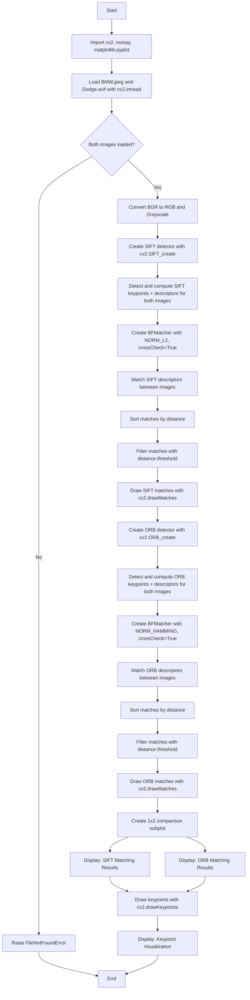

# CV Assignment 7: Feature Points Detection and Matching

This assignment demonstrates **feature point detection** and **feature matching** between two images using the **SIFT** and **ORB** detectors. The goal is to locate **common objects** (in this case, cars) across the `BMW.jpeg` and `Dodge.avif` images by detecting key points, computing descriptors, and matching them using a Brute-Force matcher with `crossCheck=True`.

---

## Theory

### What Are Feature Points?

**Feature points** (also called key points or interest points) are distinctive, well-defined locations in an image — corners, blobs, edges — that can be reliably detected across different views of the same scene or object. They serve as "anchors" for establishing correspondences between images, enabling tasks like image alignment, object recognition, panorama stitching, and 3D reconstruction.

### What Is a Descriptor?

A **descriptor** is a compact vector that describes the local appearance of an image patch around a key point. For each detected key point, the detector computes a descriptor — a fixed-length vector that captures the local texture, gradients, or binary patterns. Two descriptors of the same physical point in different images should be similar (close in descriptor space) even if the images differ in scale, rotation, or lighting.

### 1. SIFT — Scale-Invariant Feature Transform

SIFT is one of the most robust and widely used feature detectors. It produces 128-dimensional floating-point descriptors that are invariant to **scale**, **rotation**, and partially invariant to **illumination** and **viewpoint**.

#### How SIFT works:

1. **Scale-space extrema detection:** The image is convolved with Gaussian kernels at multiple scales, and the Difference-of-Gaussian (DoG) is computed. Local extrema in the DoG across scale and space are identified as candidate key points.

2. **Keypoint localization:** Each candidate is refined using Taylor expansion to find sub-pixel accuracy, and candidates with low contrast or edge-like responses (unstable) are filtered out.

3. **Orientation assignment:** A dominant orientation is computed for each key point based on gradient directions in its local neighborhood. This makes the descriptor rotation-invariant.

4. **Descriptor generation:** A 16×16 region around each key point is divided into a 4×4 grid of sub-regions. For each sub-region, an 8-bin orientation histogram is computed (from gradient magnitude and direction). This produces a 128-dimensional descriptor vector (4 × 4 × 8 = 128).

#### Key properties of SIFT:
- Descriptors are **128-dimensional** floating-point vectors.
- Distance metric: **Euclidean distance** (`cv2.NORM_L2`).
- Robust but **computationally expensive** and **patented** (patent expired in 2020).

### 2. ORB — Oriented FAST and Rotated BRIEF

ORB is a fast, efficient, and **patent-free** alternative to SIFT. It combines the FAST keypoint detector with the BRIEF descriptor, adding orientation to achieve rotation invariance.

#### How ORB works:

1. **FAST Keypoint Detection:** The FAST algorithm detects corners by comparing a pixel's intensity to a set of contiguous pixels on a Bresenham circle. Harris corner response is used to rank and filter the detected points.

2. **Orientation Assignment:** Each key point is assigned an orientation based on the **intensity centroid**, making it rotation-invariant.

3. **BRIEF Descriptor with Rotation:** Instead of computing full gradient histograms (like SIFT), ORB computes a **binary descriptor** (256 bits) by comparing pixel intensities at pairs of locations determined by a rotation-aware sampling pattern.

#### Key properties of ORB:
- Descriptors are **256-bit** binary vectors (or 32-byte arrays).
- Distance metric: **Hamming distance** (`cv2.NORM_HAMMING`).
- **Fast** and **lightweight** — suitable for real-time applications.
- Less robust than SIFT on significant scale or viewpoint changes, but excellent for moderate transformations.

### 3. Brute-Force Matching with crossCheck

The **Brute-Force (BF) matcher** compares every descriptor in image 1 against every descriptor in image 2, computing a distance for each pair. With `crossCheck=True`, the matcher keeps only **mutual best matches** — pairs where descriptor A's nearest neighbor is descriptor B, and B's nearest neighbor is A. This dramatically reduces false positive matches.

After cross-check matching, the matches are **sorted by distance** (lower distance = better match) and a **distance threshold** is applied (`0.75 × max_distance`) to filter out poor matches. This ensures only high-confidence correspondences are retained.

#### Distance metrics:
- **SIFT (128-dim float descriptors):** Euclidean distance (`cv2.NORM_L2`)
- **ORB (256-bit binary descriptors):** Hamming distance (`cv2.NORM_HAMMING`)

### 4. Lowe's Ratio Test (alternative method)

An alternative to `crossCheck` is the **Lowe's ratio test** using `knnMatch(k=2)`. For each descriptor, the two nearest neighbors are found. If the best match's distance is less than `ratio × second_best_distance` (commonly 0.7–0.8), the match is retained. This test exploits the observation that ambiguous matches (where multiple descriptors are nearly equidistant) are likely false positives.

---

## Code Explanation (Cell by Cell)

### Cell 1: Imports

```python
import cv2
import numpy as np
import matplotlib.pyplot as plt
```

- **cv2** — OpenCV's Python module for image loading, feature detection, descriptor computation, matching, and drawing.
- **numpy** — Used for array manipulation and numerical operations.
- **matplotlib.pyplot** — Used for displaying images and match results in subplot grids.

### Cell 2: Load the Images

```python
bmw_path = 'BMW.jpeg'
dodge_path = 'Dodge.avif'

img1_bgr = cv2.imread(bmw_path)
img2_bgr = cv2.imread(dodge_path)

if img1_bgr is None:
    raise FileNotFoundError(f'Could not load image: {bmw_path}')
if img2_bgr is None:
    raise FileNotFoundError(f'Could not load image: {dodge_path}')
```

`cv2.imread()` loads both images in **BGR** format. Each is checked for successful loading — if `imread` returns `None`, a `FileNotFoundError` is raised with a helpful message.

```python
img1_rgb = cv2.cvtColor(img1_bgr, cv2.COLOR_BGR2RGB)
img2_rgb = cv2.cvtColor(img2_bgr, cv2.COLOR_BGR2RGB)

img1_gray = cv2.cvtColor(img1_bgr, cv2.COLOR_BGR2GRAY)
img2_gray = cv2.cvtColor(img2_bgr, cv2.COLOR_BGR2GRAY)
```

Images are converted to **RGB** for correct display with Matplotlib (which expects RGB ordering), and to **grayscale** for feature detection (SIFT and ORB operate on single-channel intensity images).

### Cell 3: SIFT Key Point Detection

```python
sift = cv2.SIFT_create()

kp1_sift, des1_sift = sift.detectAndCompute(img1_gray, None)
kp2_sift, des2_sift = sift.detectAndCompute(img2_gray, None)
```

`cv2.SIFT_create()` creates a SIFT detector/descriptor extractor object. `detectAndCompute(image, mask)` performs two operations in one call:

- **detect** — finds key points in the image (scale-space extrema, refined to sub-pixel accuracy, with assigned orientations).
- **compute** — computes the 128-dimensional SIFT descriptor for each key point.

The method returns `kp` (a list of `cv2.KeyPoint` objects containing coordinates, size, angle, and response) and `des` (a NumPy array of shape `(N, 128)` where N is the number of key points).

### Cell 4: SIFT Feature Matching

```python
bf_sift = cv2.BFMatcher(cv2.NORM_L2, crossCheck=True)

matches_sift = bf_sift.match(des1_sift, des2_sift)
matches_sift = sorted(matches_sift, key=lambda x: x.distance)
```

`cv2.BFMatcher(cv2.NORM_L2, crossCheck=True)` creates a Brute-Force matcher that:
- Uses **Euclidean distance** (L2 norm) — the correct metric for SIFT's 128-dimensional floating-point descriptors.
- `crossCheck=True` ensures that only **mutual nearest neighbors** are returned as matches, significantly reducing false positives.

`bf_sift.match()` finds the best match for each descriptor in set 1 against all descriptors in set 2. The resulting matches are then **sorted by distance** so the best (lowest distance) matches come first.

```python
max_dist = 0.75 * max(m.distance for m in matches_sift)
good_matches_sift = [m for m in matches_sift if m.distance < max_dist]
```

A **distance threshold** filters out poor matches. Matches with distance below `0.75 × max_distance` are retained. This removes weak correspondences while keeping high-confidence matches.

### Cell 5: ORB Key Point Detection

```python
orb = cv2.ORB_create(nfeatures=2000)

kp1_orb, des1_orb = orb.detectAndCompute(img1_gray, None)
kp2_orb, des2_orb = orb.detectAndCompute(img2_gray, None)
```

`cv2.ORB_create(nfeatures=2000)` creates an ORB detector that will extract up to 2000 key points per image (the default is 500). Like SIFT, `detectAndCompute` detects key points and computes descriptors in one call. ORB descriptors are binary vectors of length 256 (stored as `uint8` arrays of shape `(N, 32)`).

### Cell 6: ORB Feature Matching

```python
bf_orb = cv2.BFMatcher(cv2.NORM_HAMMING, crossCheck=True)

matches_orb = bf_orb.match(des1_orb, des2_orb)
matches_orb = sorted(matches_orb, key=lambda x: x.distance)
```

The ORB matcher uses `cv2.NORM_HAMMING` (Hamming distance) instead of `cv2.NORM_L2` because ORB descriptors are **binary vectors**. Hamming distance counts the number of differing bits between two binary vectors — it is both the natural and computationally efficient metric for binary descriptors.

The same crossCheck and distance threshold filtering approach is applied as with SIFT.

### Cell 7: Comparison Plot

```python
fig, axes = plt.subplots(1, 2, figsize=(32, 14))

axes[0].imshow(img_matches_sift)
axes[0].set_title(f'SIFT Matching — {len(good_matches_sift[:100])} Matches')
axes[0].axis('off')

axes[1].imshow(img_matches_orb)
axes[1].set_title(f'ORB Matching — {len(good_matches_orb[:100])} Matches')
axes[1].axis('off')

plt.tight_layout()
plt.show()
```

A 1×2 subplot grid displays the matched features from SIFT and ORB side by side, with green lines connecting corresponding points between the two images.

### Cell 8: Keypoint Visualization

```python
img1_kp_sift = cv2.drawKeypoints(
    img1_rgb, kp1_sift, None,
    flags=cv2.DRAW_MATCHES_FLAGS_DRAW_RICH_KEYPOINTS
)
```

`cv2.drawKeypoints()` overlays detected key points on the original image. The flag `DRAW_MATCHES_FLAGS_DRAW_RICH_KEYPOINTS` draws each key point as a circle with a line indicating its orientation and scale, providing a full visual representation of the detected features.

---

## Program Flow



---

## Files

| File | Description |
|------|-------------|
| `code.ipynb` | Jupyter notebook implementing feature detection (SIFT, ORB) and matching between `BMW.jpeg` and `Dodge.avif`. |
| `BMW.jpeg` | First sample input image (a BMW car). |
| `Dodge.avif` | Second sample input image (a Dodge car). |
| `output.png` | Cached output visualization showing matched features between the two images. |
| `README.md` | This documentation. |

---

## Results Summary

| Detector | Image 1 (BMW) Keypoints | Image 2 (Dodge) Keypoints | Total Matches | Good Matches |
|----------|------------------------|--------------------------|---------------|--------------|
| SIFT | 599 | 4235 | 301 | 118 |
| ORB | 2000 | 2000 | 499 | 250 |

---

## Frequently Asked Questions

### Q1: Why use `crossCheck=True` instead of the ratio test?

`crossCheck=True` is simpler and produces **mutual nearest neighbor** matches — only pairs where each descriptor's best match is the other descriptor are kept. This eliminates one-way matches that are likely false positives. The ratio test (Lowe's method) finds the two nearest neighbors and keeps the match if the ratio of distances is below a threshold. Both are valid; `crossCheck` is more restrictive and often sufficient when matching between images of different objects.

### Q2: What is the difference between `cv2.NORM_L2` and `cv2.NORM_HAMMING`?

- `cv2.NORM_L2` (Euclidean distance) is used for **floating-point descriptors** like SIFT's 128-dimensional vectors. It computes the straight-line distance in high-dimensional space.
- `cv2.NORM_HAMMING` (Hamming distance) is used for **binary descriptors** like ORB's 256-bit vectors. It counts the number of differing bits between two binary strings. Using the wrong distance metric produces incorrect, unreliable matches.

### Q3: Why convert to grayscale before feature detection?

SIFT and ORB detect key points based on **intensity variations** in the image. Color information is not directly useful for detecting geometric features — edges, corners, and blobs are defined by intensity gradients, not color. Grayscale reduces the image to a single channel, making detection faster and more reliable. Color features (like color histograms) are typically used as a complementary descriptor, not for key point detection.

### Q4: Why might SIFT find fewer key points on one image than the other?

The number of detected key points depends on image content. Images with rich texture, many edges, and high contrast (e.g., a car with detailed body panels, reflections, and background elements) produce more key points. Images that are smoother, more uniform, or have large flat regions (e.g., a car with a plain paint job) produce fewer key points. In this assignment, the Dodge image has more detectable features (4235 SIFT key points) compared to the BMW image (599 key points).

### Q5: What is the role of `cv2.drawMatches`?

`cv2.drawMatches(img1, kp1, img2, kp2, matches, None, ...)` creates a visualization that places the two images side by side and draws colored lines (or arrows) connecting corresponding key points. It is an essential debugging and presentation tool — by visually inspecting the matches, you can assess whether the detector and matcher are producing meaningful correspondences.

### Q6: Why might ORB find more matches than SIFT?

ORB is configured with `nfeatures=2000`, which forces it to extract up to 2000 key points per image, compared to SIFT's adaptive detection. More key points means more potential matches. However, more matches do not necessarily mean **better** matches — ORB is faster but less discriminative than SIFT, especially when matching between very different objects (different car models). SIFT's 128-dimensional descriptors are more distinctive, leading to fewer false matches.

### Q7: What is the purpose of `cv2.DRAW_MATCHES_FLAGS_DRAW_RICH_KEYPOINTS`?

This flag tells `cv2.drawKeypoints()` to draw each key point as a **circle with a directional line** — the circle's radius represents the key point's scale (size of the feature), and the line represents its orientation. This provides a complete visual representation of the detected features, including their scale and rotation invariance properties. Without this flag, only simple dots are drawn.

### Q8: Can SIFT and ORB be used for matching the same pair of images interchangeably?

Yes. SIFT and ORB are both general-purpose feature detectors. The choice depends on requirements:
- **SIFT** is preferred when accuracy is paramount (e.g., object recognition, panorama stitching) and computational cost is acceptable.
- **ORB** is preferred for real-time applications (e.g., AR, SLAM) where speed matters and moderate accuracy is sufficient.

### Q9: What happens if I set `crossCheck=False`?

With `crossCheck=False` (the default), `bf.match()` returns the **single best match** for each descriptor in the first set — but without checking if it's also the best match in the other direction. This can produce many false positives (one-to-many matches). With `crossCheck=True`, only mutual (two-way) best matches are kept, which is more conservative and reliable.

### Q10: Why apply a distance threshold after matching?

Even with `crossCheck=True`, some matches may have large distances, indicating a poor correspondence. Sorting matches by distance and filtering with a threshold (`0.75 × max_distance`) removes the weakest matches, keeping only high-confidence correspondences. This is especially useful for visualization — drawing too many match lines can make the output cluttered and hard to interpret.

### Q11: What is the purpose of `nfeatures=2000` in `cv2.ORB_create()`?

The `nfeatures` parameter sets the **maximum number of features** to detect. By default, ORB detects up to 500. Setting it to 2000 forces ORB to extract more key points, which can be useful when matching images with rich texture or when many matches are needed for robust alignment. For simpler images, a lower value is sufficient and faster.

### Q12: What is the difference between `bf.match()` and `bf.knnMatch()`?

- `bf.match()` returns the **single best match** for each descriptor (1-nearest neighbor).
- `bf.knnMatch(k=2)` returns the **k best matches** for each descriptor. This is used with the ratio test (Lowe's method), where you compare the best match to the second-best to determine if the match is unambiguous. `match()` with `crossCheck=True` is simpler but doesn't use the ratio test; `knnMatch` gives more control over match quality.
