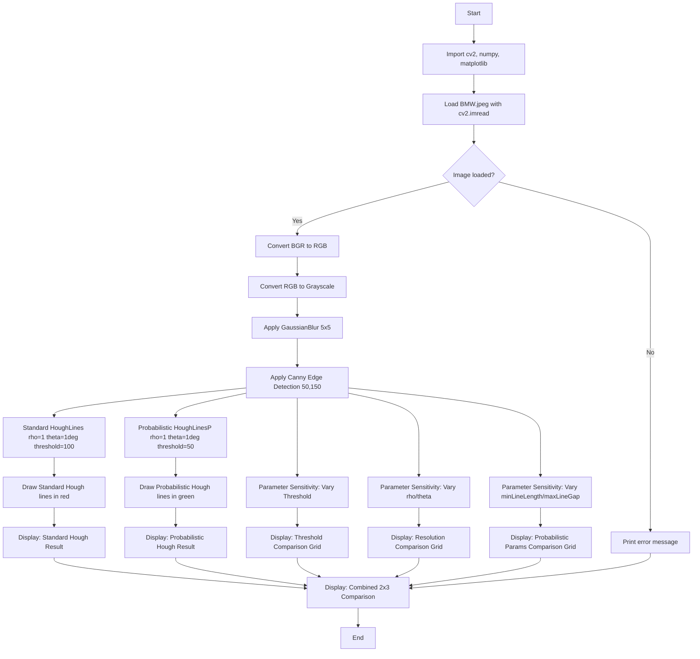

# CV Assignment 8: Hough Transform for Straight Line Detection

This assignment demonstrates **line detection** in images using the **Hough Transform**. The Hough Transform maps edge points from the image space into a parameter space where lines are represented as points of intersection, enabling robust detection of straight lines even in the presence of noise, occlusion, and gaps.

The analysis covers:

1. **Standard Hough Line Transform** (`cv2.HoughLines`) — detects lines by accumulating votes in HoughSpace.
2. **Probabilistic Hough Line Transform** (`cv2.HoughLinesP`) — a more efficient variant that directly returns line segment endpoints.
3. **Parameter Sensitivity** — how changes to `rho`, `theta`, threshold, `minLineLength`, and `maxLineGap` affect detection results.

All techniques are applied to `BMW.jpeg` and the results are visualized alongside the original image and edge map for direct comparison.

---

## Theory

### What is the Hough Transform?

The **Hough Transform** is a feature extraction technique used to detect simple shapes — most commonly **straight lines** — in images. The core idea is a **duality between points and lines**: a single point in the image space corresponds to a curve in the parameter space, and a set of collinear points in the image space corresponds to a single intersection point in the parameter space.

### Line Representation: Image Space vs. Parameter Space

A straight line in the image can be represented in multiple ways:

#### Slope-Intercept Form (unsuitable for Hough)

$$y = mx + c$$

This form fails for **vertical lines** (where $m \to \infty$), so it is not used in the Hough Transform.

#### Polar Coordinate Form (used by Hough)

Every line can be uniquely described by two parameters $(\rho, \theta)$:

$$\rho = x \cos\theta + y \sin\theta$$

Where:

- $\rho$ (rho): the **perpendicular distance** from the origin (top-left corner of the image) to the line.
- $\theta$ (theta): the **angle** of the perpendicular from the origin to the line, measured from the horizontal axis. $\theta \in [0°, 180°)$ (or $[0, \pi)$ in radians).

For any point $(x_i, y_i)$ that lies on the line, the equation $\rho = x_i \cos\theta + y_i \sin\theta$ holds. Conversely, for a fixed point $(x_i, y_i)$, varying $\theta$ traces a **sinusoidal curve** in the $(\rho, \theta)$ parameter space — this curve is called a **sinusoid** or **theta-rho curve**.

### HoughSpace (Parameter Space)

The **HoughSpace** is a 2D accumulator array indexed by $(\rho, \theta)$:

1. **Edge detection** (e.g., Canny) identifies edge points in the image.
2. For each edge point $(x_i, y_i)$, the corresponding sinusoid $\rho = x_i \cos\theta + y_i \sin\theta$ is **plotted** in the accumulator.
3. Each cell $(\rho_j, \theta_k)$ in the accumulator receives a **vote** for every sinusoid that passes through it.
4. Cells with votes **above a threshold** are identified as **peaks** — each peak corresponds to a detected line $(\rho, \theta)$.

**Key insight:** A line in the image that passes through $N$ edge points produces $N$ sinusoids that all intersect at the same point $(\rho, \theta)$ in HoughSpace. This **convergence of votes** makes the transform robust — noise points produce curves that do not converge, so they do not create significant peaks.

### Standard Hough Transform (`cv2.HoughLines`)

`cv2.HoughLines(image, rho, theta, threshold)` returns a list of $(\rho, \theta)$ pairs:

- **`rho`** — the angular resolution of $\rho$ in pixels (e.g., `1` means 1-pixel bins).
- **`theta`** — the angular resolution of $\theta$ in radians (e.g., `np.pi/180` means 1° bins).
- **`threshold`** — the minimum number of votes (intersections) required to detect a line.

Each detected line is returned as a 2-element array `[[rho, theta]]`.

### Probabilistic Hough Transform (`cv2.HoughLinesP`)

The standard Hough Transform processes **every edge pixel**, which can be slow. The **Probabilistic Hough Transform** improves efficiency by:

1. Randomly sampling a subset of edge points.
2. Extending lines only within a **region of interest** around each point.
3. Returning **line segment endpoints** $(x_1, y_1, x_2, y_2)$ instead of $(\rho, \theta)$.

`cv2.HoughLinesP(image, rho, theta, threshold, minLineLength, maxLineGap)`:

- **`minLineLength`** — the minimum number of pixels a line segment must have to be reported. Shorter segments are discarded.
- **`maxLineGap`** — the maximum allowed gap between two collinear segments for them to be merged into a single line. This bridges gaps caused by occlusion or noise.

### Parameter Sensitivity Analysis

The Hough Transform has several parameters that significantly affect detection quality:

| Parameter | Effect of Increasing | Effect of Decreasing |
|-----------|---------------------|---------------------|
| `rho` | Coarser $\rho$ resolution; fewer bins; faster but less precise line localization | Finer $\rho$ resolution; more bins; slower but more precise; uses more memory |
| `theta` | Coarser $\theta$ resolution; fewer bins; faster but angular quantization increases | Finer $\theta$ resolution; more bins; slower but better angular precision |
| `threshold` | Fewer lines detected (only strong peaks survive); fewer false positives | More lines detected including noise; more false positives |
| `minLineLength` | Only longer line segments are reported; short fragments are filtered out | Short segments are included; more fragmented results |
| `maxLineGap` | Gaps between collinear segments are bridged; more continuous lines | Gaps break lines into shorter segments; more fragmented output |

**Sensitivity guidelines:**

- **Low threshold + fine resolution** → many false lines, noisy output
- **High threshold + coarse resolution** → only dominant lines detected, may miss weaker but real lines
- **Small `minLineLength`** → detects short fragments and noise
- **Large `maxLineGap`** → connects unrelated nearby lines, potentially merging distinct features

---

## Code Explanation (Cell by Cell)

### Cell 1: Imports

```python
import cv2
import numpy as np
import matplotlib.pyplot as plt
```

- **cv2** — OpenCV's Python module for image loading, edge detection, and the Hough Transform functions.
- **numpy** — Used for array manipulation and numerical operations.
- **matplotlib.pyplot** — Used for displaying images and line overlays in subplot grids.

### Cell 2: Load Image and Edge Detection

```python
image_bgr = cv2.imread('BMW.jpeg')

if image_bgr is None:
    print('Error: Could not load the image. Please check the file path.')
else:
    image_rgb = cv2.cvtColor(image_bgr, cv2.COLOR_BGR2RGB)
    image_gray = cv2.cvtColor(image_rgb, cv2.COLOR_RGB2GRAY)
    blurred = cv2.GaussianBlur(image_gray, (5, 5), 0)
    edges = cv2.Canny(blurred, 50, 150)

    print(f'Image loaded successfully. Shape: {image_rgb.shape}')
    print(f'Edge pixels: {np.sum(edges > 0)}')
```

- `cv2.imread()` loads the image in **BGR** format.
- `cv2.cvtColor(..., cv2.COLOR_BGR2RGB)` converts to RGB for display.
- `cv2.cvtColor(..., cv2.COLOR_RGB2GRAY)` converts to grayscale — edge detection operates on single-channel images.
- `cv2.GaussianBlur(image_gray, (5, 5), 0)` applies a 5×5 Gaussian blur to reduce noise before edge detection, preventing false edges from pixel-level fluctuations.
- `cv2.Canny(blurred, 50, 150)` performs Canny edge detection with a low threshold of 50 and a high threshold of 150. These edges serve as the **input** to the Hough Transform — only edge points vote in HoughSpace.

### Cell 3: Standard Hough Transform

```python
lines = cv2.HoughLines(edges, rho=1, theta=np.pi/180, threshold=100)

if lines is not None:
    for rho, theta in lines[:, 0, :]:
        a = np.cos(theta)
        b = np.sin(theta)
        x0 = a * rho
        y0 = b * rho
        x1 = int(x0 + 1000 * (-b))
        y1 = int(y0 + 1000 * a)
        x2 = int(x0 - 1000 * (-b))
        y2 = int(y0 - 1000 * a)
        cv2.line(image_rgb, (x1, y1), (x2, y2), (0, 0, 255), 2)

plt.figure(figsize=(10, 8))
plt.imshow(image_rgb)
plt.title('Standard Hough Transform')
plt.axis('off')
plt.show()
```

- `cv2.HoughLines(edges, rho=1, theta=np.pi/180, threshold=100)` detects lines in the edge image:
  - `rho=1`: 1-pixel angular resolution for $\rho$.
  - `theta=np.pi/180`: 1° angular resolution for $\theta$.
  - `threshold=100`: a line must have at least 100 votes (edge points lying on it) to be detected.
- Each detected line is returned as $(\rho, \theta)$. The code converts these back to Cartesian endpoints using the line equation $\rho = x\cos\theta + y\sin\theta$:
  - A point on the line is $(x_0, y_0) = (\rho\cos\theta, \rho\sin\theta)$.
  - Two endpoints are computed by extending $\pm 1000$ pixels along the line direction $(-\sin\theta, \cos\theta)$.
- `cv2.line()` draws the detected lines in **red** `(0, 0, 255)` on the RGB image.

### Cell 4: Probabilistic Hough Transform

```python
lines_p = cv2.HoughLinesP(edges, rho=1, theta=np.pi/180, threshold=50,
                          minLineLength=50, maxLineGap=20)

if lines_p is not None:
    for x1, y1, x2, y2 in lines_p[:, 0, :]:
        cv2.line(image_rgb, (x1, y1), (x2, y2), (0, 255, 0), 2)

plt.figure(figsize=(10, 8))
plt.imshow(image_rgb)
plt.title('Probabilistic Hough Transform')
plt.axis('off')
plt.show()
```

- `cv2.HoughLinesP(edges, rho=1, theta=np.pi/180, threshold=50, minLineLength=50, maxLineGap=20)` returns line **segments** defined by their endpoints $(x_1, y_1, x_2, y_2)$:
  - `threshold=50`: lower vote threshold than the standard transform (fewer points needed since it samples).
  - `minLineLength=50`: line segments shorter than 50 pixels are discarded.
  - `maxLineGap=20`: gaps up to 20 pixels between collinear segments are bridged.
- Lines are drawn in **green** `(0, 255, 0)` to distinguish from the standard Hough result.

### Cell 5: Parameter Sensitivity — Varying Threshold

```python
thresholds = [30, 80, 150, 200]
fig, axes = plt.subplots(1, len(thresholds) + 1, figsize=(24, 5))

axes[0].imshow(edges, cmap='gray')
axes[0].set_title('Edge Map')
axes[0].axis('off')

for i, t in enumerate(thresholds):
    lines_t = cv2.HoughLines(edges, rho=1, theta=np.pi/180, threshold=t)
    display = image_rgb.copy()
    if lines_t is not None:
        for rho, theta in lines_t[:, 0, :]:
            a, b = np.cos(theta), np.sin(theta)
            x0, y0 = a * rho, b * rho
            x1 = int(x0 + 1000 * (-b))
            y1 = int(y0 + 1000 * a)
            x2 = int(x0 - 1000 * (-b))
            y2 = int(y0 - 1000 * a)
            cv2.line(display, (x1, y1), (x2, y2), (0, 0, 255), 2)
    axes[i + 1].imshow(display)
    axes[i + 1].set_title(f'Threshold = {t}\nLines: {len(lines_t) if lines_t is not None else 0}')
    axes[i + 1].axis('off')

plt.tight_layout()
plt.show()
```

Demonstrates how the **detection threshold** controls the number of detected lines:

| Threshold | Behavior |
|-----------|----------|
| 30 | Many lines detected, including noise-induced false positives |
| 80 | Balanced — most real lines detected with few false positives |
| 150 | Only strong, well-supported lines remain |
| 200 | Only the most dominant lines; many real lines missed |

### Cell 6: Parameter Sensitivity — Varying `rho` and `theta`

```python
configs = [
    (1, np.pi/180, 'rho=1, theta=1°'),
    (2, np.pi/90, 'rho=2, theta=2°'),
    (5, np.pi/36, 'rho=5, theta=5°'),
]

fig, axes = plt.subplots(1, len(configs) + 1, figsize=(24, 5))

axes[0].imshow(edges, cmap='gray')
axes[0].set_title('Edge Map')
axes[0].axis('off')

for i, (rho, theta, label) in enumerate(configs):
    lines_r = cv2.HoughLines(edges, rho=rho, theta=theta, threshold=100)
    display = image_rgb.copy()
    if lines_r is not None:
        for r, t in lines_r[:, 0, :]:
            a, b = np.cos(t), np.sin(t)
            x0, y0 = a * r, b * r
            x1 = int(x0 + 1000 * (-b))
            y1 = int(y0 + 1000 * a)
            x2 = int(x0 - 1000 * (-b))
            y2 = int(y0 - 1000 * a)
            cv2.line(display, (x1, y1), (x2, y2), (0, 0, 255), 2)
    axes[i + 1].imshow(display)
    axes[i + 1].set_title(f'{label}\nLines: {len(lines_r) if lines_r is not None else 0}')
    axes[i + 1].axis('off')

plt.tight_layout()
plt.show()
```

Demonstrates how **resolution parameters** affect detection:

| Config | Behavior |
|--------|----------|
| `rho=1, theta=1°` | Finest resolution; most precise line localization; most lines detected |
| `rho=2, theta=2°` | Moderate resolution; slight quantization in both parameters |
| `rho=5, theta=5°` | Coarse resolution; lines are angularly quantized; fewer lines detected; faster |

### Cell 7: Parameter Sensitivity — Probabilistic Hough with `minLineLength` and `maxLineGap`

```python
configs_p = [
    (50, 10, 'minLen=50, maxGap=10'),
    (100, 30, 'minLen=100, maxGap=30'),
    (150, 60, 'minLen=150, maxGap=60'),
]

fig, axes = plt.subplots(1, len(configs_p) + 1, figsize=(24, 5))

axes[0].imshow(edges, cmap='gray')
axes[0].set_title('Edge Map')
axes[0].axis('off')

for i, (ml, mg, label) in enumerate(configs_p):
    lines_p2 = cv2.HoughLinesP(edges, rho=1, theta=np.pi/180,
                               threshold=50, minLineLength=ml, maxLineGap=mg)
    display = image_rgb.copy()
    if lines_p2 is not None:
        for x1, y1, x2, y2 in lines_p2[:, 0, :]:
            cv2.line(display, (x1, y1), (x2, y2), (0, 255, 0), 2)
    axes[i + 1].imshow(display)
    axes[i + 1].set_title(f'{label}\nSegments: {len(lines_p2) if lines_p2 is not None else 0}')
    axes[i + 1].axis('off')

plt.tight_layout()
plt.show()
```

Demonstrates how `minLineLength` and `maxLineGap` control segment quality in the probabilistic transform:

| Config | Behavior |
|--------|----------|
| `minLen=50, maxGap=10` | Many short segments; gaps up to 10px bridged |
| `minLen=100, maxGap=30` | Longer segments; gaps up to 30px bridged; cleaner output |
| `minLen=150, maxGap=60` | Only long segments; large gaps bridged; may merge distinct lines |

### Cell 8: Combined Comparison

```python
fig, axes = plt.subplots(2, 3, figsize=(20, 12))

axes[0, 0].imshow(image_rgb)
axes[0, 0].set_title('Original Image')
axes[0, 0].axis('off')

axes[0, 1].imshow(edges, cmap='gray')
axes[0, 1].set_title('Canny Edges')
axes[0, 1].axis('off')

# Standard Hough with default params
if lines is not None:
    h_display = image_rgb.copy()
    for rho, theta in lines[:, 0, :]:
        a, b = np.cos(theta), np.sin(theta)
        x0, y0 = a * rho, b * rho
        x1 = int(x0 + 1000 * (-b))
        y1 = int(y0 + 1000 * a)
        x2 = int(x0 - 1000 * (-b))
        y2 = int(y0 - 1000 * a)
        cv2.line(h_display, (x1, y1), (x2, y2), (0, 0, 255), 2)
axes[0, 2].imshow(h_display)
axes[0, 2].set_title(f'Standard Hough (threshold=100)\nLines: {len(lines)}')
axes[0, 2].axis('off')

# Probabilistic Hough with default params
if lines_p is not None:
    p_display = image_rgb.copy()
    for x1, y1, x2, y2 in lines_p[:, 0, :]:
        cv2.line(p_display, (x1, y1), (x2, y2), (0, 255, 0), 2)
axes[1, 0].imshow(p_display)
axes[1, 0].set_title(f'Probabilistic Hough\nSegments: {len(lines_p)}')
axes[1, 0].axis('off')

# Edge map + threshold sensitivity
axes[1, 1].imshow(edges, cmap='gray')
axes[1, 1].set_title('Canny Edges (input to Hough)')
axes[1, 1].axis('off')

# Summary grid or additional comparison
axes[1, 2].axis('off')
axes[1, 2].set_title('Parameter sensitivity shown in Cells 5-7')

plt.tight_layout()
plt.show()
```

A **2×3 subplot grid** provides a comprehensive overview: the original image, the edge map (Hough input), standard Hough result, probabilistic Hough result, and additional sensitivity views.

---

## Program Flow



---

## Files

| File | Description |
|------|-------------|
| `code.ipynb` | Jupyter notebook implementing Hough Transform line detection with parameter sensitivity analysis. |
| `BMW.jpeg` | Sample input image (a BMW car) used for line detection demonstrations. |
| `README.md` | This documentation. |

---

## Frequently Asked Questions

### Q1: Why does the Hough Transform use polar coordinates instead of slope-intercept form?

The slope-intercept form $y = mx + c$ cannot represent **vertical lines** (where $m \to \infty$). The polar form $\rho = x\cos\theta + y\sin\theta$ represents all lines, including vertical ones, without any singularities. Additionally, $(\rho, \theta)$ provides a natural, bounded parameter space: $\rho$ is bounded by the image diagonal and $\theta \in [0, \pi)$.

### Q2: How does the accumulator array work in the Hough Transform?

The accumulator is a 2D array indexed by discretized $(\rho, \theta)$ values. For each edge point $(x_i, y_i)$, the algorithm computes $\rho = x_i\cos\theta + y_i\sin\theta$ for every $\theta$ in the range and increments the accumulator cell at the nearest $(\rho, \theta)$ bin. After processing all edge points, cells with values above the threshold are peaks — each peak represents a detected line.

### Q3: What is the relationship between the Canny edge detector and the Hough Transform?

The Canny edge detector provides the **input** to the Hough Transform. The Hough Transform only considers edge points as voters in HoughSpace. The quality of Canny edge detection directly affects Hough Transform results:
- **Too low Canny thresholds** → many noise edges → false Hough lines
- **Too high Canny thresholds** → missing edge points → real lines may not accumulate enough votes
- **Optimal Canny thresholds** → clean edges → robust Hough detection

### Q4: What happens if `rho` is set too large (e.g., `rho=10`)?

With `rho=10`, the $\rho$ axis is quantized in 10-pixel increments. Lines that differ by only a few pixels in perpendicular distance will map to the **same bin**, causing them to merge. This reduces precision and may cause distinct parallel lines to be detected as one. However, it reduces memory usage and computation time.

### Q5: What happens if `theta` is set too large (e.g., `theta=10°`)?

With `theta=10°`, the angular resolution is very coarse — only 18 possible $\theta$ values. Lines at different angles may map to the same bin, causing **angular quantization errors**. A line at 5° and one at 15° would both map to the $\theta=10°$ bin. This can cause lines to be detected at incorrect angles. Finer $\theta$ resolution (e.g., 1° = $\pi/180$) is preferred for accuracy.

### Q6: How does `minLineLength` affect the probabilistic Hough Transform?

`minLineLength` sets the minimum number of pixels a line segment must span to be reported. A **small value** (e.g., 10) allows short fragments, which may include noise. A **large value** (e.g., 200) filters out short segments, keeping only prominent lines. Setting it too high may cause real but partially occluded lines to be missed entirely.

### Q7: How does `maxLineGap` affect line connectivity?

`maxLineGap` controls the maximum gap (in pixels) between two collinear segments that will be merged into a single line. A **small value** (e.g., 5) requires segments to be nearly contiguous, producing fragmented output. A **large value** (e.g., 50) bridges wide gaps, which can connect distinct nearby lines that happen to be roughly collinear, producing incorrect merged lines.

### Q8: Why might the Hough Transform detect lines that are not actually present?

False detections occur when:
- **Noise edges** happen to align and accumulate enough votes to exceed the threshold.
- **Coarse parameter resolution** causes votes from different lines to accumulate in the same bin.
- **Low threshold** allows weak accumulations (from a few coincidentally aligned noise points) to pass.
- **Curved features** (e.g., arcs) can produce local maxima in HoughSpace that resemble lines.

### Q9: What is the computational complexity of the Hough Transform?

For an image with $E$ edge points, $P_\rho$ $\rho$-bins, and $P_\theta$ $\theta$-bins:
- **Standard Hough:** $O(E \times P_\theta)$ — each edge point votes across all $\theta$ values.
- **Accumulator size:** $O(P_\rho \times P_\theta)$ — memory for the full accumulator array.
- **Probabilistic Hough:** Significantly faster because it samples edge points and limits line extension, reducing both time and memory.

### Q10: How can the Hough Transform be used for road lane detection?

For road lane detection:
1. Apply **Canny edge detection** to a road image.
2. Optionally restrict the Hough Transform to a **region of interest** (e.g., the lower half of the image where lanes are expected) to reduce false detections from sky, buildings, etc.
3. Use `cv2.HoughLinesP` with appropriate `minLineLength` and `maxLineGap` to detect lane line segments.
4. **Cluster** the detected segments by slope and position to identify left and right lane lines.
5. **Extrapolate** the lane lines across the full image for visualization.

The same approach works for detecting structural edges in architectural images, where straight lines represent building edges, window frames, and structural members.

---

## Requirements

- Python 3.x
- OpenCV (`opencv-python`)
- NumPy
- Matplotlib

## How to Run

1. Ensure `BMW.jpeg` is in the same directory as `code.ipynb`
2. Activate the conda `cv-env` environment:
   ```bash
   conda activate cv-env
   ```
3. Run the notebook cells sequentially in Jupyter Notebook / JupyterLab / VS Code
4. The output will display the original image, edge map, standard Hough result, probabilistic Hough result, and parameter sensitivity comparisons
