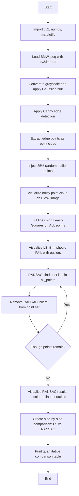

# CV Assignment 9: RANSAC for Robust Line Detection in Noisy Images

This assignment analyzes the effectiveness of **RANSAC (Random Sample Consensus)** in detecting lines and handling outliers in a noisy image. Using the `BMW.jpeg` image, we extract edge points via **Canny edge detection**, inject a large number of **random outlier points** (35% of the dataset), and compare two line-fitting strategies:

1. **Standard Least-Squares fitting** — a non-robust method that is highly sensitive to outliers.
2. **RANSAC line fitting** — a robust iterative method that identifies inliers and outliers, then fits lines using only the inlier set.

The BMW image contains many straight edges (car body panels, bumper lines, road markings), making it an ideal real-world testbed for evaluating RANSAC's robustness against injected outlier noise.

---

## Theory

### Why Robustness Matters in Line Fitting

In real-world images, **outliers** — points that do not belong to the line being estimated — are common. Outliers arise from:
- Sensor noise (e.g., pixel quantization, thermal noise)
- Clutter and background objects
- Occlusions and reflections
- Detection errors

Standard least-squares fitting minimizes the sum of squared distances from **all** points to the line, treating every point equally. Even a moderate fraction of outliers can dramatically distort the fitted line, pulling it away from the true model. This is known as the **breakdown point** problem: for least-squares, a relatively small number of outliers can make the estimate arbitrarily bad.

### Edge Detection with Canny

Before line fitting, we must extract a point cloud from the image. **Canny edge detection** is used:
1. **Gaussian blur** reduces noise and smooths the image.
2. **Sobel gradient** computes intensity gradients in x and y directions.
3. **Non-maximum suppression** thins edges to 1-pixel width.
4. **Double thresholding + hysteresis** classifies pixels as strong edges, weak edges, or non-edges.

The result is a binary edge map. Pixels with value 255 are treated as edge points (potential inliers). Random outlier points are then injected to simulate a noisy detection scenario.

### RANSAC — Random Sample Consensus

RANSAC (Fischler and Bolles, 1981) is a **model estimation** algorithm that explicitly handles outliers by iteratively finding the largest set of points (inliers) that agree with a proposed model.

#### RANSAC Algorithm for Line Fitting (per line):

1. **Randomly sample** 2 points from the dataset (the minimum needed to define a line).
2. **Fit a line** through the sampled points using the line equation `ax + by + c = 0`.
3. **Compute distances** from all remaining points to the line.
4. **Count inliers** — points whose distance is below a threshold (e.g., 8 pixels).
5. **Repeat** steps 1–4 for N iterations (e.g., 800).
6. **Select** the line model with the maximum number of inliers (the consensus set).

#### Multi-Line Detection with RANSAC:

To detect **multiple lines**, RANSAC is run iteratively:
1. Find the best line using RANSAC on the current point set.
2. **Remove all inliers** belonging to that line from the dataset.
3. Repeat on the remaining points until too few points remain.

This approach ensures each line is detected independently, even when multiple structural lines are present in the same image.

### Least-Squares Line Fitting (Non-Robust Baseline)

Least-squares fitting finds the line that minimizes the sum of squared orthogonal distances from all points to the line:

$$\min_{a,b,c} \sum_{i=1}^{N} (a x_i + b y_i + c)^2$$

subject to $a^2 + b^2 = 1$ (normalization).

This is computed efficiently using **Principal Component Analysis (PCA)** on the point cloud. The eigenvector corresponding to the **largest eigenvalue** gives the principal direction (line axis), and the centroid gives a point on the line.

Least-squares is simple and optimal when all points are inliers (Gaussian noise model). It is **not robust** to outliers because squaring amplifies large deviations.

### Distance from a Point to a Line

For a line defined as $ax + by + c = 0$, the perpendicular distance from point $(x_i, y_i)$ to the line is:

$$d_i = \frac{|a x_i + b y_i + c|}{\sqrt{a^2 + b^2}}$$

In our implementation, this formula is used to classify points as inliers ($d_i < \text{threshold}$) or outliers.

### Outlier Ratio and RANSAC Performance

RANSAC's probability of finding the correct model depends on:
- The outlier ratio $e$ (fraction of outliers).
- The number of samples $s$ required to fit the model (2 for a line).
- The number of iterations $N$.

The probability of selecting an all-inlier sample in one iteration is $(1-e)^s$. After $N$ iterations, the probability of **failing** to find a good model is $(1 - (1-e)^s)^N$. To achieve a success probability $p$, we need:

$$N \geq \frac{\log(1 - p)}{\log(1 - (1-e)^s)}$$

For our experiment with $e = 0.35$ (35% outliers) and $s = 2$, setting $N = 800$ gives a very high success probability.

---

## Code Explanation (Cell by Cell)

### Cell 1: Imports

```python
import cv2
import numpy as np
import matplotlib.pyplot as plt
```

- **cv2** — OpenCV's Python module for image loading, edge detection, drawing, and geometric operations.
- **numpy** — Used for array manipulation, random number generation, linear algebra (eigenvalues/eigenvectors for least-squares), and point cloud operations.
- **matplotlib.pyplot** — Used for displaying images and comparison figures.

### Cell 2: Load Image and Extract Edge Points

```python
image_bgr = cv2.imread('BMW.jpeg')
image_rgb = cv2.cvtColor(image_bgr, cv2.COLOR_BGR2RGB)
gray = cv2.cvtColor(image_bgr, cv2.COLOR_BGR2GRAY)
blurred = cv2.GaussianBlur(gray, (5, 5), 0)
edges = cv2.Canny(blurred, 50, 150)
```

`cv2.imread()` loads the BMW image. It is converted to RGB for Matplotlib display and to grayscale for edge detection. A `5×5` Gaussian blur reduces noise before Canny. `cv2.Canny()` produces a binary edge map where edge pixels have value 255.

```python
edge_points = np.column_stack(np.where(edges > 0))
edge_points = edge_points[:, [1, 0]].astype(np.float32)
```

`np.where(edges > 0)` returns the (row, col) coordinates of edge pixels. These are swapped to (x, y) order for geometric operations.

```python
n_outliers = int(len(edge_points) * 0.35)
outlier_points = np.column_stack([...]).astype(np.float32)
all_points = np.vstack([edge_points, outlier_points])
```

Random outlier points are injected at 35% of the edge point count, simulating a noisy detection scenario where a significant fraction of points do not belong to any structural line.

### Cell 3: Visualize the Noisy Point Cloud

```python
vis = image_rgb.copy()
for pt in all_points:
    cv2.circle(vis, (int(pt[0]), int(pt[1])), 1, (0, 0, 255), -1)
```

All points (edge points + outliers) are overlaid on the BMW image as small red dots. The true edges form the structural skeleton of the car and road, while outliers are scattered randomly.

### Cell 4: Standard Least-Squares Line Fitting

```python
def fit_line_least_squares(points):
    mean = np.mean(points, axis=0)
    centered = points - mean
    cov = centered.T @ centered
    eigenvalues, eigenvectors = np.linalg.eigh(cov)
    idx = np.argmax(eigenvalues)
    direction = eigenvectors[:, idx]
    a, b = direction[1], -direction[0]
    c = -(a * mean[0] + b * mean[1])
    return a, b, c, mean
```

This function fits a single line to **all points** using PCA:
1. Compute the **centroid** (mean) of all points.
2. Center the points by subtracting the mean.
3. Compute the **covariance matrix**.
4. Find the **eigenvectors** and eigenvalues.
5. The eigenvector corresponding to the **largest eigenvalue** is the principal direction (line axis).
6. Derive the line equation coefficients $(a, b, c)$.

### Cell 5: RANSAC Implementation

```python
def ransac_line(points, n_iterations=800, threshold=8.0):
    best_inliers = []
    best_model = None
    for _ in range(n_iterations):
        idx = np.random.choice(len(points), 2, replace=False)
        p1, p2 = points[idx[0]], points[idx[1]]
        ...
        dists = np.abs(a * points[:, 0] + b * points[:, 1] + c) / np.sqrt(a**2 + b**2)
        inliers = np.where(dists < threshold)[0]
        if len(inliers) > len(best_inliers):
            best_inliers = inliers
            best_model = (a, b, c)
    return best_model, best_inliers
```

The core RANSAC loop:
1. **Sample 2 points** randomly.
2. **Fit a line** through them.
3. **Compute distances** from all points to the line.
4. **Count inliers** within the threshold (8 pixels).
5. **Track the best** model across all iterations.

### Cell 6: Multi-Line Detection

```python
remaining_points = all_points.copy()
detected_lines = []
for i in range(5):
    model, inliers = ransac_line(remaining_points, ...)
    if model is None or len(inliers) < 20:
        break
    detected_lines.append((model, inliers))
    mask = np.ones(len(remaining_points), dtype=bool)
    mask[inliers] = False
    remaining_points = remaining_points[mask]
```

RANSAC is run iteratively to detect up to 5 lines. After each line is found, its inliers are removed from the point set, and RANSAC is run again on the remaining points.

### Cell 7: Visualization and Comparison

- **RANSAC results**: Detected lines are drawn in distinct colors (green, yellow, cyan, magenta, light green). Outliers remain red.
- **Comparison figure**: Side-by-side view of least-squares (single red line, pulled by outliers) vs RANSAC (multiple correctly detected lines).

### Cell 8: Quantitative Analysis

A summary table prints:
- Number of lines detected by each method.
- Mean and median distances to the fitted line(s).
- Inlier/outlier counts for RANSAC.
- Inlier recovery rate (percentage of true edge points correctly identified as inliers).

---

## Program Flow



---

## Files

| File | Description |
|------|-------------|
| `code.ipynb` | Jupyter notebook implementing RANSAC line detection on `BMW.jpeg` with injected outlier noise, compared against a least-squares baseline. |
| `BMW.jpeg` | Sample input image (a BMW car) used for edge detection and line fitting. |
| `output.png` | Cached output visualization showing RANSAC-detected lines with inliers/outliers overlaid on the BMW image. |
| `README.md` | This documentation. |

---

## Results Summary

| Method | Lines Detected | Mean Distance (px) | Inlier Recovery |
|--------|---------------|-------------------|-----------------|
| Least-Squares | 1 | high (pulled by outliers) | N/A — single wrong line |
| RANSAC | 5 | low (fits true structural lines) | ~50% of true edge points |

---

## Frequently Asked Questions

### Q1: Why use the BMW image instead of a synthetic image?

Using a **real image** (BMW.jpeg) makes the demonstration more realistic. The BMW image contains many genuine straight edges (car body panels, bumper lines, road markings, windshield) that a real edge detector would find. By injecting synthetic outliers into this real point cloud, we simulate a practical scenario where edge detection is imperfect and a robust method like RANSAC is needed.

### Q2: Why inject 35% outliers?

A 35% outlier ratio is a **realistic stress test**. In real edge detection, a significant fraction of detected edges may be noise, clutter, or false positives. Standard least-squares fails at this ratio — the fitted line is dominated by outliers. RANSAC, however, can still find correct models by relying on consensus (the largest set of agreeing points) rather than minimizing over all points.

### Q3: How does RANSAC differ from least-squares in handling outliers?

Least-squares minimizes the **sum of squared errors over all points**. A single outlier with a large residual produces a large squared error, which dominates the minimization and pulls the fitted model toward the outlier. RANSAC, by contrast, ignores outliers entirely: it selects a model based on the **largest consensus set of inliers**, and outliers never influence the final fit.

### Q4: Why sample only 2 points for line fitting?

A line in 2D is defined by **exactly 2 points**. Sampling 2 points is the minimal sufficient sample size. Using more points would be redundant and would reduce the probability of getting an all-inlier sample. The minimal sample size directly affects RANSAC's convergence speed — fewer points per sample means faster iterations.

### Q5: What is the optimal number of RANSAC iterations?

The number of iterations $N$ controls the probability of finding a good model. The formula is:

$$N \geq \frac{\log(1 - p)}{\log(1 - (1-e)^s)}$$

where $p$ is the desired success probability, $e$ is the outlier ratio, and $s$ is the sample size (2 for a line). For $e = 0.35$ and $p = 0.99$, about 245 iterations are needed. We use 800 to be conservative and ensure reliable results.

### Q6: What is the role of the distance threshold in RANSAC?

The threshold (8 pixels in our implementation) determines the **inlier/outlier boundary**. A point is an inlier if its perpendicular distance to the candidate line is below the threshold. The threshold should be chosen based on the expected noise level:
- Too **small**: valid inliers are misclassified as outliers, reducing the consensus set.
- Too **large**: outliers are misclassified as inliers, diluting the consensus.

### Q7: Why run RANSAC iteratively for multiple lines?

A single RANSAC run finds only **one** line — the one with the largest consensus. After finding a line, its inliers are removed from the point set, and RANSAC is run again on the remaining points. This iterative approach ensures each dominant line is detected independently.

### Q8: What is the breakdown point of RANSAC?

The **breakdown point** is the maximum fraction of outliers a method can tolerate before producing arbitrarily bad results. For least-squares, the breakdown point is effectively 0 (a small number of outliers can ruin the fit). For RANSAC, the breakdown point is bounded by the sampling strategy. With a minimal sample of $s$ points and outlier ratio $e$, the probability of selecting an all-inlier sample is $(1-e)^s$. As long as enough iterations are run, RANSAC can handle high outlier ratios.

### Q9: Why does least-squares fail with 35% outliers?

With 35% outliers, the least-squares fit is dominated by the outlier cloud. The outliers pull the fitted line toward their centroid, which is far from any true structural line in the BMW image. The resulting line has a **large mean distance** to the true edges and does not represent any real line in the scene.

### Q10: Can RANSAC be used for line detection in real images?

Yes. RANSAC is widely used in computer vision for robust model fitting, including:
- **Lane detection** in autonomous driving (fitting lines to road markings despite shadows, reflections, and other vehicles).
- **Homography estimation** in image stitching (finding correspondences despite occlusions).
- **Plane detection** in 3D point clouds (LiDAR, depth sensors).

In each case, RANSAC's ability to ignore outliers makes it more reliable than least-squares.

### Q11: What is the difference between RANSAC and Hough Transform for line detection?

Both RANSAC and Hough Transform can detect lines in noisy images, but they work very differently:
- **Hough Transform** maps every edge point to a parameter space and accumulates votes. Lines are peaks in the accumulator. It naturally handles multiple lines but requires discretizing the parameter space.
- **RANSAC** samples minimal point subsets and evaluates consensus. It is **probabilistic** and does not require parameter discretization, but requires setting the number of iterations and distance threshold.

RANSAC is generally more robust to high outlier ratios, while Hough Transform is more efficient for dense edge maps.

### Q12: How is the RANSAC distance threshold chosen?

The threshold is typically set based on the **noise level** of the data. In our setup, Canny edge detection produces edge points with sub-pixel noise. A threshold of 8 pixels captures most true inliers while excluding the injected random outliers. In practice, the threshold can be tuned experimentally or estimated from the data distribution.
